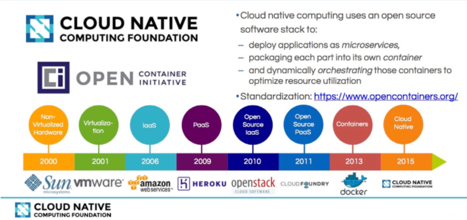
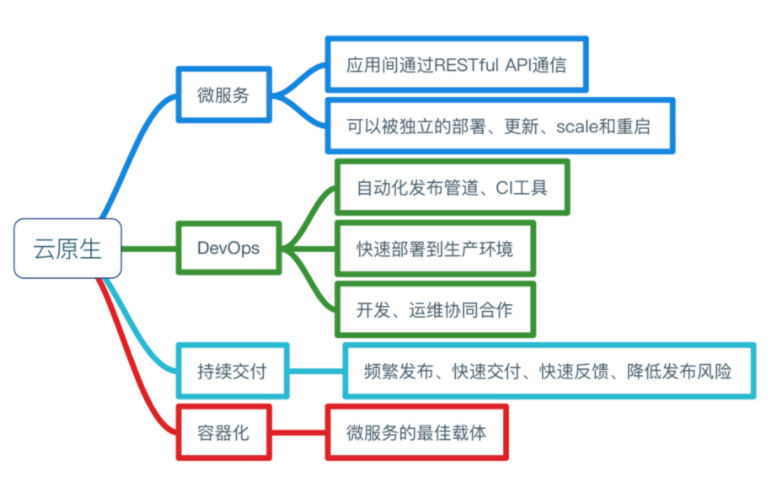
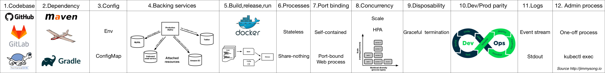

# 云原生学习101-云原生概览

> 云原生学习笔记：[《kubernetes-handbook》](https://jimmysong.io/kubernetes-handbook/cloud-native/kubernetes-and-cloud-native-app-overview.html),来自这本书。

## 从云计算到微服务再到云原生发展历程

见下图

(来自：https://jimmysong.io/kubernetes-handbook/cloud-native/kubernetes-and-cloud-native-app-overview.html)

### 云计算：

云计算是一种配置资源的方式，根据资源配置不同，把云计算分成下面3种类型：

- lasS：基础设施即服务。比如亚马逊的EC2、S3存储。
- PaaS：平台及服务。工具和服务的集合。快速构建自己的应用服务而不必关系底层的硬件设施。厂家有：Cloud Foundry、Heroku等
- SaaS：软件即服务。终端可以直接使用的应用程序。基于互联网来提供的服务，比如Google Docs，github，各种云存储。

### 微服务：

微服务是一种架构设计理念。

把大的应用进行合理分解，划分成小的服务，然后把这些小的服务进行组合，形成应用，提供给用户使用。

一个小的服务就是一个微服务，是一个独立的实体，可以独立部署。

### 云原生组成：

Cloud Native 的组成：

(CloudNative的组成：https://jimmysong.io/kubernetes-handbook/cloud-native/kubernetes-and-cloud-native-app-overview.html)

**云原生要解决的问题：**

为了解决传统应用的一些问题：

1.架构臃肿

2.升级缓慢

3.不能快速部署

4.不能快速迭代

5.不能弹性扩容

... ...

等等问题。

**云原生的特点：**

- 敏捷
- 可靠
- 高弹性
- 易扩展
- 故障隔离
- 应用保护
- 不中断业务持续更新

## Kubernetes与云原生

kubernets 是云原生系统的底层基础设施之一。

它的目标不仅仅是一个编排系统，而是一个规范，可以让你构建弹性，可扩展的分布式架构。

### 12 factor app

1. 基准代码
2. 依赖
3. 配置
4. 后端服务
5. 构建、发布、运行
6. 进程
7. 端口绑定
8. 并发
9. 易处理
10. 开发环境和线上环境等价
11. 日志
12. 管理进程

后面随着云原生发展，又增加了 3 个因素：

13. API 优先
14. 监控
15. 认证授权