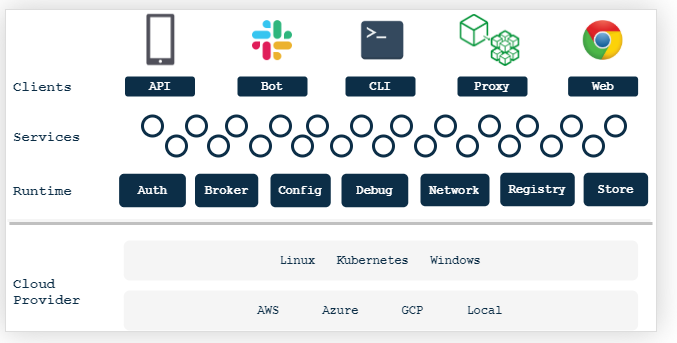
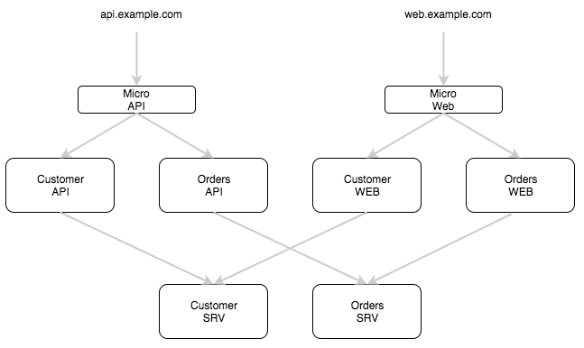
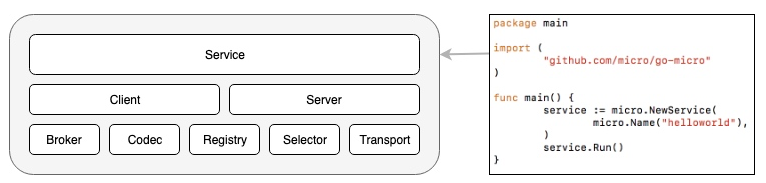
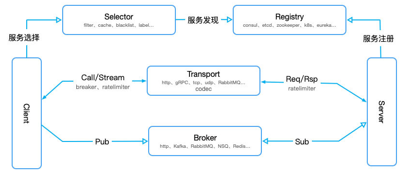

**golang微服务框架go-micro学习(01)-Micro微服务框架整体介绍**

## 一、Micro

### 架构图


 Micro 是一个平台，它使用可插拔的基础和强定义的 api 来解决这些问题。可插入任何堆栈或云.

 运行时由以下功能组成:

- **api gateway**: api 网关。使用服务发现具有动态请求路由的单个入口点. API 网关允许您在后端构建可扩展的微服务体系结构，并在前端合并公共 api. micro api 通过发现和可插拔处理程序提供强大的路由，为 http, grpc, Websocket, 发布事件等提供服务.
- **broker**: 允许异步消息的消息代理。微服务是事件驱动的体系结构，应该作为一等公民提供消息传递。通知其他服务的事件，而无需担心响应.
- **network**: 通过微网络服务构建多云网络。只需跨任何环境连接网络服务，创建单个平面网络即可全局路由. Micro 的网络根据每个数据中心中的本地注册表动态构建路由，确保根据本地设置路由查询.
- **new**: 服务模板生成器。创建新的服务模板以快速入门. Micro 提供用于编写微服务的预定义模板。始终以相同的方式启动，构建相同的服务以提高工作效率.
- **proxy**: 建立在 Go Micro 上的透明服务代理。将服务发现，负载平衡，容错，消息编码，中间件，监视等代理路由到某个位置。独立运行它或与服务一起运行.
- **registry**: 注册表提供服务发现以查找其他服务，存储功能丰富的元数据和终结点信息。它是一个服务资源管理器，允许您在运行时集中和动态地存储此信息.
- **store**: 有状态是任何系统的必然需求。我们提供密钥值存储，提供简单的状态存储，可在服务之间共享或长期持有 以保持微服务无状态和水平可扩展.
- **web**: Web 仪表板允许您浏览服务，描述其终结点，请求和响应格式，甚至直接查询它们。仪表板还包括内置 CLI 的体验，适用于希望动态进入终端的开发人员.

此外，Micro还提供了Go开发框架：
- **go-micro**: 利用强大的 [Go Micro](https://github.com/micro/go-micro) 框架轻松，快速地开发微服务. Go Micro 抽象了分布式系统的复杂性，并提供了更简单的抽象来构建高度可扩展的微服务.

### 什么是Micro

Micro 使开发人员能够构建、共享和协作式的分布式系统：
- Micro 有一个 [运行时](https://github.com/micro/micro)，可以管理你的微服务

- Micro 有一个 [go-micro 框架](https://github.com/micro/go-micro)，可以编写服务

- Micro 有一个 [社区](https://slack.micro.mu/)，可以讨论和解答Micro的各种问题

Micro是一个多工具集合， 有micro这个管理工具、go-micro框架 和 go-plugins插件 等各种工具和框架，以帮助人们更好的进行微服务开发。

- **框架** - go-micro框架，编写微服务的 Go 框架；服务发现，远程过程调用，发布 / 订阅等.
- **运行时** - 微服务运行时环境；用于管理服务包括auth，config，discovery，networking的运行时环境。.
- **插件** - 框架和运行时的插件，包括 etcd, kubernets, nats, grpc, 等.
- **客户端**：多语言客户端
可以在 [**github.com/micro**](https://github.com/micro) 上找到所有的工具

使用 [micro](https://github.com/micro/micro) 工具包通过 cli, web ui, slack 或 api 网关访问微服务.

Micro 由开源库与工具组成，旨在辅助微服务开发。

- [micro](https://github.com/micro/micro) - 微服务工具集包含传统的入口点（entry point）；API 网关、CLI、Slack Bot、代理及 Web UI。还有其它相关的库和服务可以参考 github.com/micro。
  - API可以作为单个http入口点
   - Web仪表盘用于可视化服务
   - 用于命令行访问的 CLI
   - 全新魔板生成代码可快速启动
   - 通过 Slack 或 HipChat 查询的机器人供
- [go-micro](https://github.com/micro/go-micro) - 基于 Go 语言的可插拔 RPC 微服务开发框架；包含服务发现、RPC 客户/服务端、广播/订阅机制等等。
  - 抽象了分布式系统的元素
  - 服务发现、远程调用-RPC，发布订阅等功能
  - 超时、重试和负载均衡等功能
  - 通过包装器还可以扩展功能
  - 可插拔的接口设计
- [go-plugins](https://github.com/micro/go-plugins) - go-micro 的插件库，有 etcd、kubernetes、nats、rabbitmq、grpc 等等。
  - 用于 go-micro/micro 的插件
   - 包括一些流行的后端技术，grpc，kubernetes，kafka等
   - 还有一些经过生成检验过的插件

### 如何使用Micro？

1. 可以通过 [micro](https://github.com/micro/micro) 工具包访问它们.
2. 可以使用 [go-micro](https://github.com/micro/go-micro) 编写服务.

#### 使用工具包运行服务

[工具包命令参考文档](https://learnku.com/docs/go-micro/2.x/getting-started.html/8460)，这个是中文翻译版。

[英文 docs](https://github.com/micro/docs/blob/master/getting-started/README.md)

在bash里运行命令 `micro server`， 这个命令来启动micro服务器，如果顺利的话，会输出很多初始化的日志。
与此服务器交互，可以用CLI，交互命令为：`micro env set server`

然后可以查看运行的服务：`micro list services`
```shell
# micro list services
go.micro.api
go.micro.auth
go.micro.bot
go.micro.broker
go.micro.config
go.micro.debug
go.micro.network
go.micro.proxy
go.micro.registry
go.micro.router
go.micro.runtime
go.micro.server
go.micro.web
```

可以去 [github.com/micro/services](https//github.com/micro/services) 看看, 我们看到一堆由 mirco 作者编写的服务。你可以查看文档，然后用命令试试其中的一些服务。

### API，Web和SRV服务之间的区别是什么？
先看一张图：


作为 micro 工具包的一部分, 我们尝试通过分离 API, Web 仪表板和后端服务 (SRV） 的关注点, 为可扩展体系结构定义一组设计模式.

可以这么理解：API就是前端的访问，SRV就是后端提供的服务， 而 Web 仪表盘就是能查看这些，可视化。

- **API服务**
API服务是单独的一个服务层，用于为http/json API提供服务。API服务由micro api提供。
可以用go-micro编写标准的服务，使用命名空间go.micro.api在逻辑上进行分离。

- **Web服务**
Web服务又默认命名空间go.micro.web提供服务。Micro Web是反向代理，将根据服务解析路径到HTTP请求转发到相应的Web应用。

- **SRV服务**
SRV服务是标准的RPC服务，是你通常编写的服务类型。通常称他们为RPC服务或后端服务，他们是后端体系的一部分，不是面向公众的。默认情况下，使用命名空间 go.micro.srv 进行操作，但你应该使用域 com.example.srv。

## 二、Go-Micro

### 什么是Go-Micro
go-micro是一个微服务开发的框架，是一个插件式的RPC框架。它用于分布式系统开发。这个插件抽象出了分布式系统各个组件。

>from https://micro.mu/ ， 图3

### 它的主要组成如下：

- **Registry 服务注册与发现** 
Registry模块提供了可插拔的服务注册与发现功能。目前实现的consul,mdns, etcd,etcdv3,zookeeper,kubernetes.等等，
go-micro 将此类任务抽象到一个接口中，接口位于 `github.com/micro/go-micro/v2/registry/Registry` ：
```go
// The registry provides an interface for service discovery
// and an abstraction over varying implementations
// {consul, etcd, zookeeper, ...}
type Registry interface {
	Init(...Option) error
	Options() Options
	Register(*Service, ...RegisterOption) error
	Deregister(*Service, ...DeregisterOption) error
	GetService(string, ...GetOption) ([]*Service, error)
	ListServices(...ListOption) ([]*Service, error)
	Watch(...WatchOption) (Watcher, error)
	String() string
}
```

- **Selector 服务选择逻辑** 
Selector选择器实现了负载均衡机制。当客户端请求服务时，Selector 根据不同的算法从 Registery 的主机列表中得到可用的 Service 节点列表。选择器会选择其中的一个来提供服务。多次调用选择器会触发均衡算法，当前算法有round robin（循环调度），哈希随机和黑名单。接口在：github.com\micro\go-micro\v2\client\selector\Selector，selector.go，在client文件夹下，
```Go
// Selector builds on the registry as a mechanism to pick nodes
// and mark their status. This allows host pools and other things
// to be built using various algorithms.
type Selector interface {
	Init(opts ...Option) error
	Options() Options
	// Select returns a function which should return the next node
	Select(service string, opts ...SelectOption) (Next, error)
	// Mark sets the success/error against a node
	Mark(service string, node *registry.Node, err error)
	// Reset returns state back to zero for a service
	Reset(service string)
	// Close renders the selector unusable
	Close() error
	// Name of the selector
	String() string
}
```

- **Broker 异步消息** 
Broker是消息发布和订阅的可插拔接口，属于异步消息，异步消息是降低解耦、提供系统鲁棒性的关键技术。接口为：github.com/micro/go-micro/v2/broker/Broker，broker.go
```go
// Broker is an interface used for asynchronous messaging.
type Broker interface {
	Init(...Option) error
	Options() Options
	Address() string
	Connect() error
	Disconnect() error
	Publish(topic string, m *Message, opts ...PublishOption) error
	Subscribe(topic string, h Handler, opts ...SubscribeOption) (Subscriber, error)
	String() string
}
```
go-plugins中已有的 [broker](https://github.com/micro/go-plugins/tree/master/broker) 插件， 包括 RabbitMQ, Kafka,NSQ等，默认实现基于 http，也是无需配置。
这个可用于事件驱动的微服务架构。

- **Transport 传输协议** 
Transport定义了传输协议，这个接口也是可插拔的。默认使用 HTTP 同步通信，也可以支持 TCP、UDP、NATS、gRPC 等其他方式。它的接口在 github.com/micro/go-micro/v2/transport/Transport，transport.go
```go
// Transport is an interface which is used for communication between
// services. It uses connection based socket send/recv semantics and
// has various implementations; http, grpc, quic.
type Transport interface {
	Init(...Option) error
	Options() Options
	Dial(addr string, opts ...DialOption) (Client, error)
	Listen(addr string, opts ...ListenOption) (Listener, error)
	String() string
}
```

- **Client 客户端** 
Client客户端提供发起RPC请求的能力。
它集合了注册（registry）、选择器（selector）、broker、传输（transport），当然也具备重试、超时、上下文等。接口在 github.com/micro/go-micro/v2/client/Client，client.go
```Go
// Client is the interface used to make requests to services.
// It supports Request/Response via Transport and Publishing via the Broker.
// It also supports bidirectional streaming of requests.
type Client interface {
	Init(...Option) error
	Options() Options
	NewMessage(topic string, msg interface{}, opts ...MessageOption) Message
	NewRequest(service, endpoint string, req interface{}, reqOpts ...RequestOption) Request
	Call(ctx context.Context, req Request, rsp interface{}, opts ...CallOption) error
	Stream(ctx context.Context, req Request, opts ...CallOption) (Stream, error)
	Publish(ctx context.Context, msg Message, opts ...PublishOption) error
	String() string
}
```

- **Server 服务器**
 Serve服务是运行了真实微服务的程序。
 监听服务调用的接口，也将以接收 Broker 推送过来的消息，需要向 Registry 注册自己的存在与否，以便客户端发起请求，和 Client 一样，默认基于 RPC 协议通信，也可以替换为 HTTP 或 gRPC； 接口在：github.com/micro/go-micro/v2/server/Server，server.go
 ```Go
// Server is a simple micro server abstraction
type Server interface {
	// Initialise options
	Init(...Option) error
	// Retrieve the options
	Options() Options
	// Register a handler
	Handle(Handler) error
	// Create a new handler
	NewHandler(interface{}, ...HandlerOption) Handler
	// Create a new subscriber
	NewSubscriber(string, interface{}, ...SubscriberOption) Subscriber
	// Register a subscriber
	Subscribe(Subscriber) error
	// Start the server
	Start() error
	// Stop the server
	Stop() error
	// Server implementation
	String() string
}
```
 
 - **Codec 编码解码** 
用于解决传输过程中消息编码和解码，消息传输的格式。对应的接口在 
github.com/micro/go-micro/v2/codec/Codec，codec.go
```Go
// Codec encodes/decodes various types of messages used within go-micro.
// ReadHeader and ReadBody are called in pairs to read requests/responses
// from the connection. Close is called when finished with the
// connection. ReadBody may be called with a nil argument to force the
// body to be read and discarded.
type Codec interface {
	Reader
	Writer
	Close() error
	String() string
}
```
默认实现是 protobuf，也可以替换成 json、bson、msgpack 等；

> 说明：上面的v2，表示 go-micro v2.9.1，因为我用的这版本开发。

### Service

上面图3中最顶层的 Service 是系统中最核心的接口，它把其他核心接口有机的组织在一起，协调运行。包含了一系列用于初始化 Server 和 Client 的方法，使我们可以很简单的创建一个 RPC 服务；

创建一个服务的函数 `NewService()`，客户端和服务端都会调用这个函数来创建一个服务，这个函数位于：github.com\micro\go-micro\v2\micro.go
```Go
// NewService creates and returns a new Service based on the packages within.
func NewService(opts ...Option) Service {
    return newService(opts...) // <1> 这个函数
}
```

上面函数 `NewService()` 返回的 `Service`  值是一个接口interface，也是位于github.com\micro\go-micro\v2\micro.go：
```Go
// Service is an interface that wraps the lower level libraries
// within go-micro. Its a convenience method for building
// and initialising services.
type Service interface {
    // The service name
    Name() string
    // Init initialises options
    Init(...Option)
    // Options returns the current options
    Options() Options
    // Client is used to call services
    Client() client.Client
    // Server is for handling requests and events
    Server() server.Server
    // Run the service
    Run() error
    // The service implementation
    String() string
}
```

上面函数 `NewService()` 里标 `<1>` 内容：`newService(opts...)`，这个 `newService()` 函数位于github.com\micro\go-micro\v2\service.go：
```Go
func newService(opts ...Option) Service {
    service := new(service) // <2>
    options := newOptions(opts...)

    // service name
    serviceName := options.Server.Options().Name

    // we pass functions to the wrappers since the values can change during initialisation
    authFn := func() auth.Auth { return options.Server.Options().Auth }
    cacheFn := func() *client.Cache { return options.Client.Options().Cache }

    // wrap client to inject From-Service header on any calls
    options.Client = wrapper.FromService(serviceName, options.Client)
    options.Client = wrapper.TraceCall(serviceName, trace.DefaultTracer, options.Client)
    options.Client = wrapper.CacheClient(cacheFn, options.Client)
    options.Client = wrapper.AuthClient(authFn, options.Client)

    // wrap the server to provide handler stats
    options.Server.Init(
        server.WrapHandler(wrapper.HandlerStats(stats.DefaultStats)),
        server.WrapHandler(wrapper.TraceHandler(trace.DefaultTracer)),
        server.WrapHandler(wrapper.AuthHandler(authFn)),
    )

    // set opts
    service.opts = options

    return service
}
```

上面函数 `newService()` 里标 `<2>`  地方的内容 `service := new(service)` ， 这段代码里的 `service`，
它是一个结构体 struct，位于 github.com\micro\go-micro\v2\service.go
```Go
type service struct {     
    opts Options     // <3>
    once sync.Once
}
```

service 结构体里面的 `Options`  (标 <3> 地方) 位于 github.com\micro\go-micro\v2\options.go 中，包含了很多 interface，比如 `Server`，`Client`， `Registry` 等等接口，
```Go
// Options for micro service
type Options struct {
    Auth      auth.Auth
    Broker    broker.Broker
    Cmd       cmd.Cmd
    Config    config.Config
    Client    client.Client
    Server    server.Server
    Store     store.Store
    Registry  registry.Registry
    Runtime   runtime.Runtime
    Transport transport.Transport
    Profile   profile.Profile

    // Before and After funcs
    BeforeStart []func() error
    BeforeStop  []func() error
    AfterStart  []func() error
    AfterStop   []func() error

    // Other options for implementations of the interface
    // can be stored in a context
    Context context.Context

    Signal bool
}
```
> 从上面的代码分析可以看出：**Service** 把其他核心接口有机的组织在一起，然后协调运行。

### Plugins

Micro 官方创建了一个 [Plugins](https://github.com/micro/go-plugins) 仓库，用于维护 Go Micro 核心接口支持的可替换插件：

| 接口      | 支持组件                             |
| --------- | ------------------------------------ |
| Broker    | NATS、NSQ、RabbitMQ、Kafka、Redis 等 |
| Client    | gRPC、HTTP                           |
| Codec     | BSON、Mercury 等                     |
| Registry  | Etcd、NATS、Kubernetes、Eureka 等    |
| Selector  | Label、Blacklist、Static 等          |
| Server    | gRPC、HTTP                           |
| Transport | NATS、gPRC、RabbitMQ、TCP、UDP       |
| Wrapper   | 中间件：熔断、限流、追踪、监控       |

各个组件接口之间的关系可以通过下图串联：



## 三、Go-Micro 学习资源
- [micro](https://github.com/micro/micro)
- [go-micro](https://github.com/micro/go-micro)
- [go-plugins](https://github.com/micro/go-plugins)
- [docs](https://github.com/micro/docs)
- [site](https://m3o.dev/)
- [go-micro 2.X中文文档](https://learnku.com/docs/go-micro/2.x)
- [go-micro一些资源](https://learnku.com/docs/go-micro/2.x/resources/8459)
- [awesome-micro](https://github.com/micro-community/awesome-micro)
- [micro-in-cn](https://github.com/micro-in-cn)

## 四、参考
- [go-micro 2.x 中文文档](https://learnku.com/docs/go-micro/2.x)
- [micro](https://github.com/hb-go/micro)
