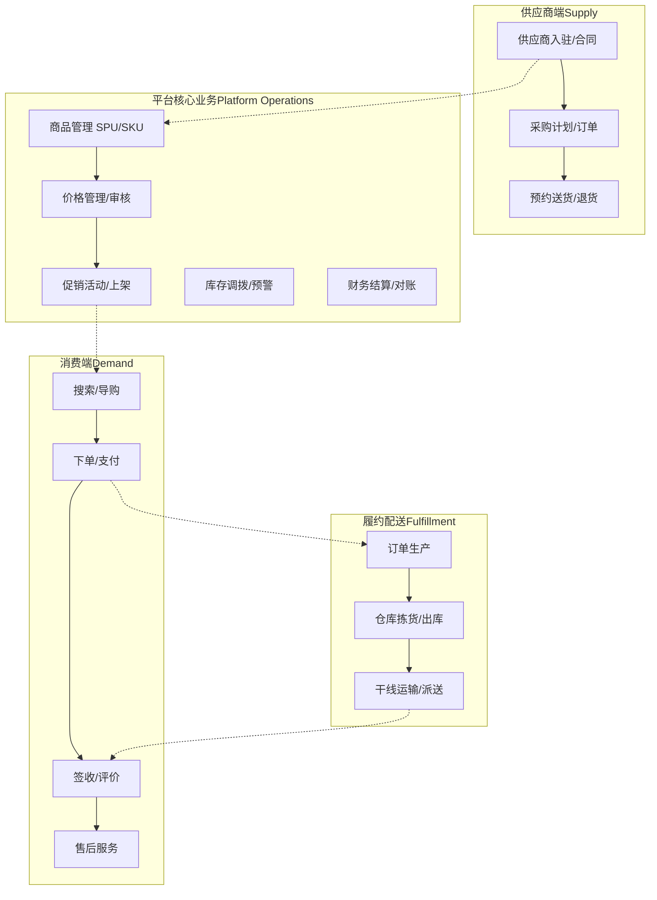
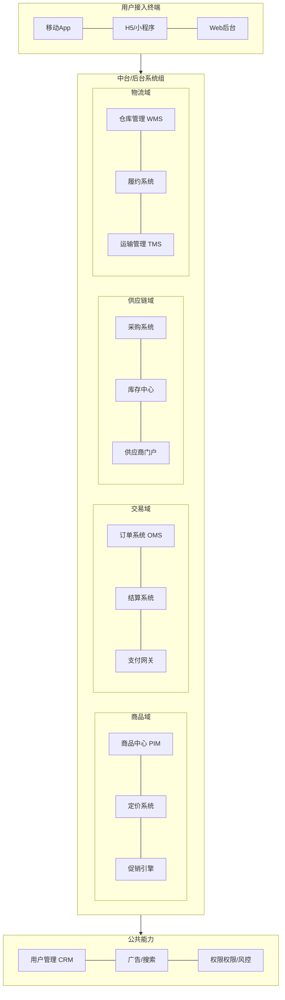

在互联网行业中，B2C商城的架构演进是一个典型且极具代表性的技术发展历程。这一演进过程深刻反映了业务快速增长与技术架构持续优化之间的辩证关系。本文将详细阐述一个B2C商城系统从V1.0到V4.0的架构演进历程，包括业务架构、应用架构和技术架构的变迁，以及每个阶段面临的核心挑战和相应的解决方案。

架构演进的驱动力通常来自多个方面：用户规模的爆发式增长导致系统性能瓶颈不断显现；商品品类的持续扩展对系统可维护性提出更高要求；业务功能的日益复杂使得代码逻辑越来越难以管理；以及团队规模的扩大需要更清晰的职责划分和更高的开发效率。理解这一演进过程，对于架构师和开发人员来说具有重要的借鉴意义，它不仅展示了具体技术选型的决策过程，更揭示了如何在业务压力和技术债务之间取得平衡的智慧。

## 业务架构图

## 应用架构图

