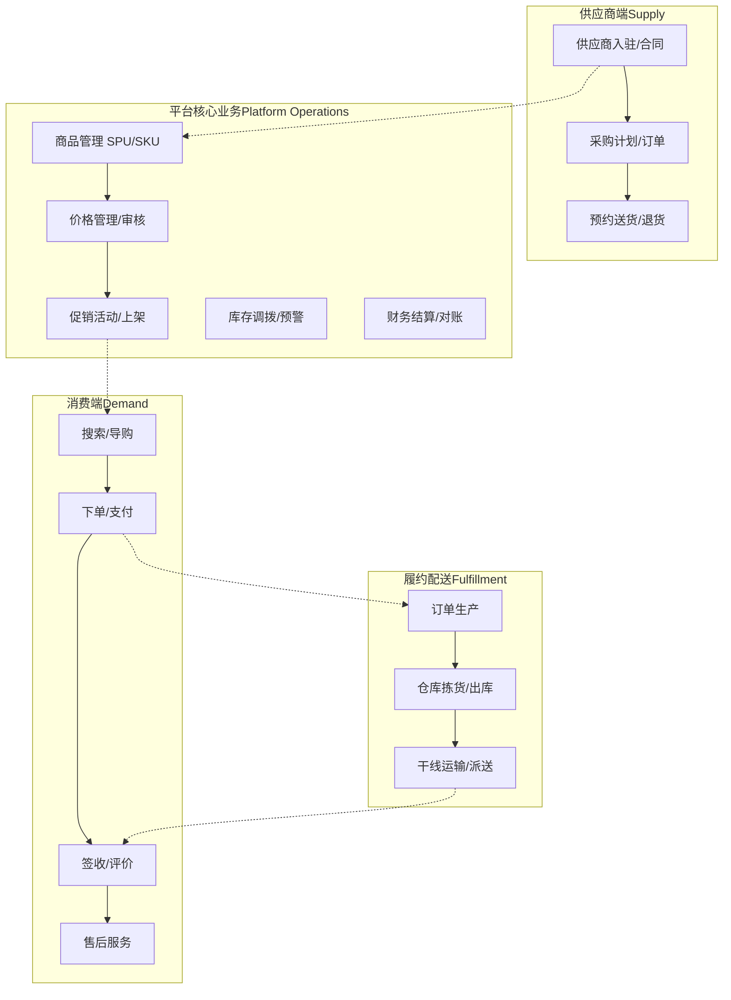
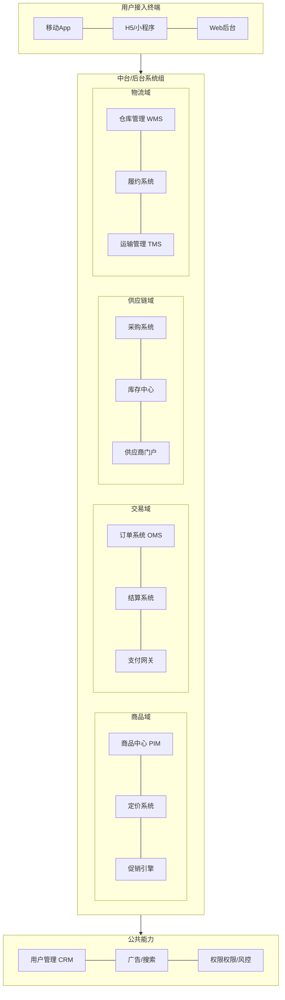

## 一、前言

在互联网行业中，B2C 电商的发展，都是从小到大，从用户几千人到用户几百万人，个别电商甚至过亿的用户数。然而这些电商业务的发展都不是一夜之间就发展起来，都有一个漫长的发展历程。

在这个漫长的业务发展过程中，电商的的系统架构演进随着业务的快速发展而变化，从原来的单体应用到多个应用，从服务化到微服务化、从分布式、中台化，系统都经过漫长的演变。

电商系统是一个具代表性的技术发展历程。这一演进过程深刻反映了业务快速增长与技术架构持续优化之间的辩证关系。本文将详细阐述一个 B2C 商城系统从 V1.0 到 V4.0 的架构演进历程，包括业务架构、应用架构等多个架构的变迁，以及每个阶段面临的核心挑战和相应的解决方案。

一个系统架构演进的驱动力通常来自多个方面：

- 用户规模的爆发式增长导致系统性能瓶颈不断显现；

- 商品品类的持续扩展对系统可维护性提出更高要求；

- 业务功能的日益复杂使得代码逻辑越来越难以管理；
- 团队规模的扩大需要更清晰的职责划分，也需要组织更高的开发效率。

理解这一演进过程，对于架构师和开发人员来说也很有意义，它不仅展示了具体技术选型的决策过程，更揭示了如何在业务快速发展压力和技术债务之间取得平衡，懂得取舍的智慧。

## 二、V1.0 时代：快速上线验证

### 2.1 业务背景和技术选型

在项目启动初期，团队面临的核心挑战是快速验证商业模式，尽快将产品推向市场接受用户检验。

这一阶段的电商业务需求非常简单：

- 功能需求相对简单，主要包含商品展示、购物车、订单处理、支付集成等核心业务流程；

- 用户规模预期有限，初期可能只有几千到几万的日活用户；

- 开发团队规模较小，通常只有 3 到 5 名开发人员；

- 项目周期紧张，需要在 1 到 2 个月内完成上线，快速上线需求。

基于上述业务背景，技术选型遵循了"简单、高效、低成本"的原则。

PHP 作为开发语言选择了开源的 ECShop 系统作为基础框架。PHP 在当时是 Web 开发的主流语言之一，其语法简洁、学习成本低、开发效率高的特点非常适合初创项目。ECShop 作为成熟的开源商城系统，提供了完整的商城基础功能，包括商品管理、会员管理、订单处理、支付接口等，团队可以在此基础上进行二次开发，快速满足业务需求。

### 2.2 V1.0 版本架构设计

#### 架构设计图

在 V1.0 版本时期的系统架构，就是典型的三层架构模式，Nginx -> WebServer -> MySQL。

所有功能模块部署在单一的服务器上，数据库使用 MySQL，处理 PHP 请求服务 PHP-FPM，缓存层几乎没有引入，文件存储使用本地磁盘。整个系统架构图如下，

V1.0 时期的系统架构图：

#### V1.0功能模块

从应用架构的角度来看，V1.0 版本的功能模块集中，所有业务逻辑都耦合在一个单体应用中。按照功能职责，可以划分为以下几个主要模块：

**前端展示层**

负责用户界面的渲染和用户交互处理，包括首页推荐、商品搜索详情页、购物车页面、用户个人中心等模块。这一层的特点是用户直接参与交互，对页面响应速度要求较高，但业务逻辑相对简单，主要是数据的展示和表单提交处理。

**业务逻辑层**

这一层是整个电商应用的核心，包含了商城的核心业务流程和各个功能模块。

- 商品模块负责商品的增删改查、库存管理、价格计算等功能；

- 会员模块处理用户注册、登录、信息修改、积分管理等事务；

- 订单模块是业务流程的枢纽，负责购物车管理、订单创建、订单支付、订单履约、售后处理等完整流程；

**数据访问层**

负责与数据库的交互，封装了所有的SQL操作。在 ECShop 框架中，这一层主要由模型（Model）类来实现，每个数据表对应一个模型类，提供基本的CRUD操作。

**第三方集成层**

负责与外部系统的对接，主要包括支付网关（支付宝、微信支付等）、物流接口（快递100、菜鸟物流等）、短信服务（阿里大鱼、腾讯短信等）。这些集成通常以插件方式形式存在，便于替换和扩展。

#### 技术栈

V1.0 版本的技术栈具有鲜明的时代特征。Web 服务器采用 Nginx 配合 PHP-FPM 的组合，这是当时 Linux 环境下最流行的 Web 服务架构。数据库使用MySQL，考虑到初期数据量不大，采用了单实例部署方案，为了提高可靠性配置了主从复制。

缓存层几乎没有引入，唯一的缓存是 PHP 自带的 OPcode缓存（如APC）来提升代码执行效率。文件存储使用 Web 服务器所在的本地磁盘，商品图片等静态资源也存放在同一服务器上。操作系统选择 CentOS 或 Ubuntu 版本，Web 环境采用 LNMP（Linux + Nginx + MySQL + PHP）架构。

#### 架构扩展

随着业务发展，用户增多，功能增多。

系统架构也会进行扩展，比如 V1.1、V1.2、V1.3版架构等。

增加 web 服务器，前面用 Nginx 做负载均衡，增加数据库扩展，一主多从，增加 Redis 缓存。

### 2.3 V1.0版本的问题与局限

随着业务的快速发展，V1.0 架构的问题逐渐暴露出来。

**1、性能瓶颈**：

当用户量增长到日活数万时，单一服务器的架构无法承受突发的访问流量，特别是在促销活动期间，服务器 CPU 和内存使用率经常达到90%以上，响应时间从正常的几百毫秒飙升到数秒甚至超时。数据库成为最大的性能瓶颈，所有的读写操作都集中在同一个MySQL实例上，查询复杂度较高的报表和统计功能严重影响在线交易。

**2、可扩展性**：

V1.0 架构采用水平扩展的方式极为困难，因为所有模块都部署在同一应用中，无法针对压力较大的模块进行单独扩展。例如，当商品浏览量很大但订单量相对较小时，只能通过复制整个应用来分担压力，这造成了资源的浪费。数据库的扩展更是难题，垂直拆分需要大量的代码改造，水平拆分需要解决跨库查询和事务一致性问题。

**3、可维护性**：

随着业务功能的不断增加，代码量迅速膨胀到一个难以管理的规模。ECShop 的模板引擎虽然方便，但前端代码和业务逻辑混在一起，修改时很容易引入新的 bug。业务代码和框架代码界限不清，框架升级时需要大量兼容处理。团队成员对整个系统的理解成本越来越高，一个小需求的改动可能影响到多个看似不相关的功能。

**4、技术债务**：

为了快速上线，很多功能采用了"临时方案"，比如直接在数据库表中添加冗余字段、使用存储过程处理复杂业务逻辑、没有统一的异常处理机制等。这些技术债务在短期内提高了开发速度，但随着时间推移，维护成本呈指数级增长。

这些问题促使团队开始思考架构的升级改造，V2.0 版本的架构重构便提上了日程。

## 三、V2.0时代：Java重写与架构重构

### 3.1 重构驱动力与技术选型

进入 V2.0 阶段时，业务已经取得了初步成功，用户规模和交易量都有了显著增长。此时团队面临的核心挑战是：

**如何在保持业务连续性的同时，系统性地解决上一版本架构存在的性能和可维护性问题**。

经过深入的技术调研和讨论，团队决定采用 Java 语言对整个系统进行重写，这一决策基于多方面的考量。

## 业务架构图

## 应用架构图

