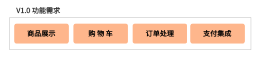
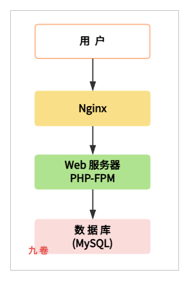
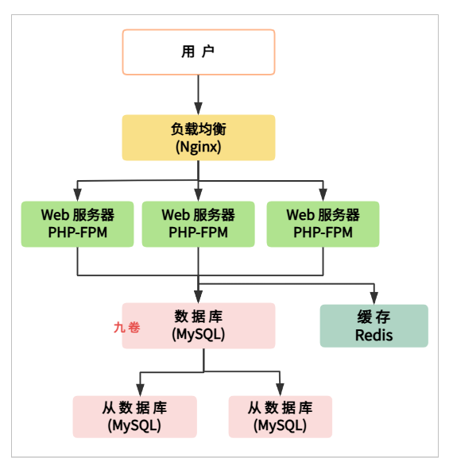
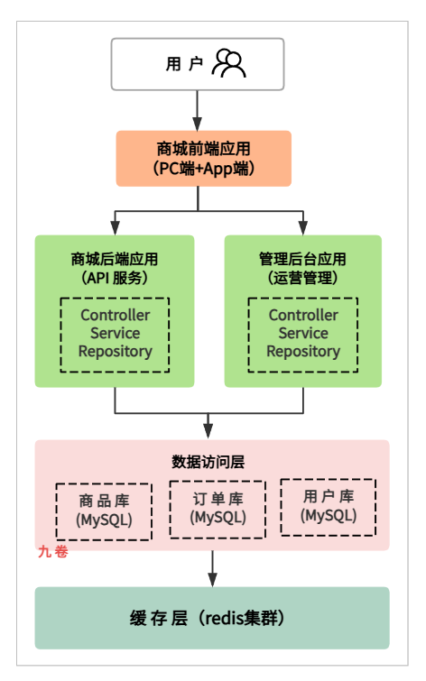
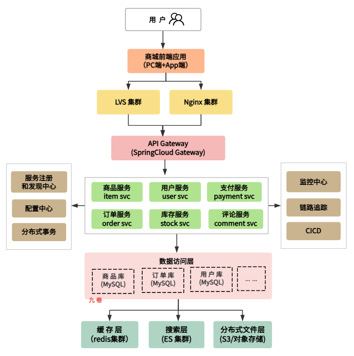
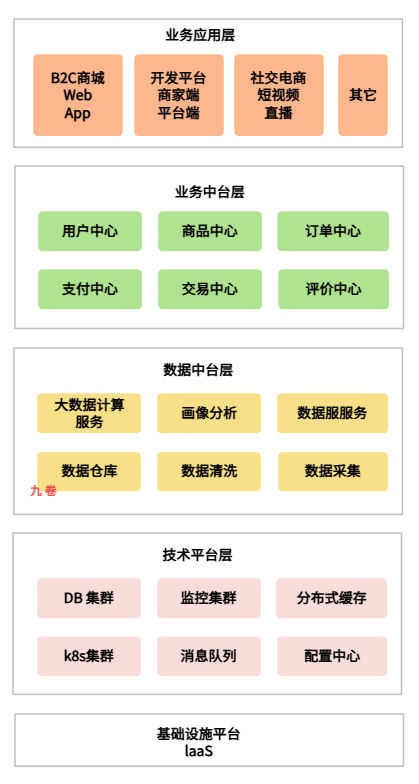
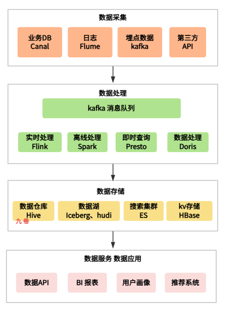

## 一、前言

在互联网行业中，B2C 电商的发展，都是从小到大，从用户几千人到用户几百万人，个别电商甚至过亿的用户数。然而这些电商业务的发展都不是一夜之间就发展起来，都有一个漫长的发展历程。

在这个漫长的业务发展过程中，电商的的系统架构演进随着业务的快速发展而变化，从原来的单体应用到多个应用，从服务化到微服务化、从分布式、中台化，系统都经过漫长的演变。

电商系统是一个具代表性的技术发展历程。这一演进过程深刻反映了业务快速增长与技术架构持续优化之间的辩证关系。本文将详细阐述一个 B2C 商城系统从 V1.0 到 V4.0 的架构演进历程，包括技术架构、数据架构等多个架构的变迁，以及每个阶段面临的核心挑战和相应的解决方案。

一个系统架构演进的驱动力通常来自多个方面：

- 用户规模的爆发式增长导致系统性能瓶颈不断显现；

- 商品品类的持续扩展对系统可维护性提出更高要求；

- 业务功能的日益复杂使得代码逻辑越来越难以管理；
- 团队规模的扩大需要更清晰的职责划分，也需要组织更高的开发效率。

理解这一演进过程，对于架构师和开发人员来说也很有意义，它不仅展示了具体技术架构演进的过程，更揭示了如何在业务快速发展压力和技术债务之间取得平衡，懂得取舍的智慧。

## 二、V1.0 时代：快速上线验证

### 2.1 业务背景和技术选型

在项目启动初期，团队面临的核心挑战是快速验证商业模式，尽快将产品推向市场接受用户检验。

这一阶段的电商业务需求非常简单：

- 功能需求相对简单，主要包含商品展示、购物车、订单处理、支付集成等核心业务流程；

- 用户规模预期有限，初期可能只有几千到几万的日活用户；

- 开发团队规模较小，通常只有 3 到 5 名开发人员；

- 项目周期紧张，需要在 1 到 2 个月内完成上线，快速上线需求。

基于上述业务背景，技术选型遵循了"简单、高效、低成本"的原则。

PHP 作为开发语言选择了开源的 ECShop 系统作为基础框架。PHP 在当时是 Web 开发的主流语言之一，其语法简洁、学习成本低、开发效率高的特点非常适合初创项目。ECShop 作为成熟的开源商城系统，提供了完整的商城基础功能，包括商品管理、会员管理、订单处理、支付接口等，团队可以在此基础上进行二次开发，快速满足业务需求。

### 2.2 V1.0 版本架构设计

#### 架构设计图

在 V1.0 版本时期的系统架构，就是典型的三层架构模式，Nginx -> WebServer -> MySQL。

所有功能模块部署在单一的服务器上，数据库使用 MySQL，处理 PHP 请求服务 PHP-FPM，缓存层几乎没有引入，文件存储使用本地磁盘。整个系统架构图如下，

V1.0 时期的系统架构图：

#### V1.0功能模块

从应用架构的角度来看，V1.0 版本的功能模块集中，所有业务逻辑都耦合在一个单体应用中。按照功能职责，可以划分为以下几个主要模块：

**前端展示层**

负责用户界面的渲染和用户交互处理，包括首页推荐、商品搜索详情页、购物车页面、用户个人中心等模块。这一层的特点是用户直接参与交互，对页面响应速度要求较高，但业务逻辑相对简单，主要是数据的展示和表单提交处理。

**业务逻辑层**

这一层是整个电商应用的核心，包含了商城的核心业务流程和各个功能模块。

- 商品模块负责商品的增删改查、库存管理、价格计算等功能；

- 会员模块处理用户注册、登录、信息修改、积分管理等事务；

- 订单模块是业务流程的枢纽，负责购物车管理、订单创建、订单支付、订单履约、售后处理等完整流程；

- 一些简单的促销功能，如折扣、优惠券等。

**数据访问层**

负责与数据库的交互，封装了所有的 SQL 操作。在 ECShop 框架中，这一层主要由模型（Model）类来实现，每个数据表对应一个模型类，提供基本的 CRUD 操作。

**第三方集成层**

负责与外部系统的对接，主要包括支付网关（支付宝、微信支付等）、物流接口（快递100、菜鸟物流等）、短信服务（阿里大鱼、腾讯短信等）。这些集成通常以插件方式形式存在，便于替换和扩展。

#### 技术栈

V1.0 版本的技术栈具有鲜明的时代特征。Web 服务器采用 Nginx 配合 PHP-FPM 的组合，这是当时 Linux 环境下最流行的 Web 服务架构。数据库使用 MySQL，考虑到初期数据量不大，采用了单实例部署方案，为了提高可靠性配置了主从复制。

缓存层几乎没有引入，唯一的缓存是 PHP 自带的 OPcode 51缓存（如APC）来提升代码执行效率。文件存储使用 Web 服务器所在的本地磁盘，商品图片等静态资源也存放在同一服务器上。操作系统选择 CentOS 或 Ubuntu 版本，Web 环境采用 LNMP（Linux + Nginx + MySQL + PHP）架构。

#### 架构扩展

随着业务发展，用户增多，功能增多。

系统架构也会进行扩展，比如 V1.1、V1.2、V1.3版本架构等。

增加 web 服务器，前面用 Nginx 做负载均衡，增加数据库扩展，一主多从，增加 Redis 缓存。

### 2.3 V1.0版本的问题

随着业务的快速发展，V1.0 架构的问题逐渐暴露出来。

**1、性能瓶颈**：

当用户量增长到一定规模，比如日活到数万时，单一服务器的架构无法承受突发的访问流量，特别是在促销活动期间，服务器 CPU 和内存使用率经常达到90%以上，响应时间从正常的几百毫秒飙升到数秒甚至超时。数据库成为最大的性能瓶颈，所有的读写操作都集中在同一个 MySQL 实例上，查询复杂度较高的报表和统计功能严重影响在线交易。

**2、可扩展性**：

V1.0 架构采用水平扩展的方式极为困难，因为所有模块都部署在同一应用中，无法针对压力较大的模块进行单独扩展。例如，当商品浏览量很大但订单量相对较小时，只能通过复制整个应用来分担压力，这造成了资源的浪费。数据库的扩展更是难题，垂直拆分需要大量的代码改造，水平拆分需要解决跨库查询和事务一致性问题。

**3、可维护性**：

随着业务功能的不断增加，代码量迅速膨胀到一个难以管理的规模。ECShop 的模板引擎虽然方便，但前端代码和业务逻辑混在一起，修改时很容易引入新的 bug。业务代码和框架代码界限不清，框架升级时需要大量兼容处理。团队成员对整个系统的理解成本越来越高，一个小需求的改动可能影响到多个看似不相关的功能。

**4、技术债务**：

为了快速上线，很多功能采用了临时方案，比如直接在数据库表中添加冗余字段、使用存储过程处理复杂业务逻辑、没有统一的异常处理机制等。这些技术债务在短期内提高了开发速度，但随着时间推移，维护成本呈指数级增长。

这些问题促使团队开始思考架构的升级改造，V2.0 版本的架构重构便提上了日程。

## 三、V2.0时代：Java重写与架构重构

### 3.1 重构驱动力与技术选型

进入 V2.0 阶段时，业务已经取得了初步成功，用户规模和交易量都有了显著增长。此时团队面临的核心挑战是：

**如何在保持业务连续性的同时，系统性地解决上一版本架构存在的性能和可维护性问题**。

经过深入的技术调研和讨论，团队决定采用 Java 语言对整个系统进行重写，这一决策基于多方面的考量。

Java 语言在企业级应用开发领域拥有成熟的生态系统。Spring 和 Spring Boot 框架提供了完善的依赖注入和面向切面编程能力，能够有效解决代码耦合问题。MyBatis、MyBatis-Plus 和 JPA 等 ORM 框架简化了数据库操作，提高了开发效率。Java 语言的强类型特性，有助于在编译期发现潜在错误，提高代码质量。丰富的开源类库和成熟的技术文档使得团队能够快速解决开发中遇到的各种问题。

此外，Java 语言在大型互联网电商企业中的广泛使用，意味着团队更容易招聘到有经验的后端开发人员，公司的技术积累也能够得到更好的传承。Java 应用的性能表现稳定可靠，在高并发场景下有成熟的优化实践。Spring Boot 框架更是大大简化了 Java 应用的配置和部署，使得开发效率得到了显著提升。

### 3.2 V2.0总体架构设计

V2.0 版本的架构，垂直拆分应用架构，主要是把应用系统进行了拆分，应用系统从单体应用拆分为多个独立的单体应用，但尚未达到微服务的程度，每个后端应用系统程序仍然采用三层结构设计，模块化功能，前后端分离，这种架构既保留了单体应用开发简便的特点，又为后续的服务化拆分奠定了一定的基础。

这时把单体应用架构拆分为前后端分离的商城前端应用、商城后端应用、管理后台应用。V1.0 时期的单一库也分为多个库 - 商品库、订单库、用户库等。

V2.0 版本的应用架构也进行了明显的职责拆分，形成了多个独立的应用系统。

**商城前端应用**：

负责用户端的页面渲染和交互处理，采用了前后端分离的思路，前端使用 Vue.js 框架构建单页应用，通过 RESTful API 与后端通信。这种分离使得前端可以独立部署和更新，提高了开发效率和用户体验。

**商城后端应用**：

提供所有的业务接口，采用 Spring Boot 框架开发，所有的业务逻辑都在这里处理。

**管理后台应用**：

供运营人员进行商品管理、订单处理、用户管理、数据统计等工作，同样采用前后端分离架构。

### 3.3 模块化设计

V2.0 版本的功能模块划分更加清晰，应用系统按照业务领域进行了垂直模块的拆分，划分如下：

**用户模块**

负责用户注册、登录、个人信息管理、会员等级、积分管理、收货地址管理等与用户相关的功能。

**商品模块**

处理商品的基础信息管理、分类管理、属性管理、SKU 管理、库存管理、价格管理等核心业务。

**交易模块**

业务核心，包含购物车、订单创建、订单支付、订单履约、售后服务等完整流程。

**营销模块**

支持各种促销活动，如优惠券、满减活动、限时折扣、拼团、秒杀等。

**内容模块**

负责文章管理、帮助中心、公告管理、评论管理等辅助功能。

**统计模块**

提供销售数据、用户行为、流量分析等数据报表。

**评论模块**

用户对商品的评论。

**支付模块**

对接第三方的支付接口、网关系统等。

**客服模块**

主要管理退货退款、售后服务等操作，包括在线客服、客服工单等。

**物流模块**

主要包括运费管理（订单、真实物流成本）、物流状态保存和查询等。

**库存模块**

商品库存管理。

**权限模块**

管理后台的权限。

### 3.4 数据架构

在应用数据架构方面，V2.0 版本进行了架构调整。针对不同业务模块的数据特点，采用了垂直分库的策略，将原来的单一数据库拆分为商品库、订单库、用户库等多个独立的数据库。

这种拆分有几个好处：

- 不同业务的数据隔离性好，单一数据库故障不影响其他业务；

- 可以根据各业务的特点，选择不同的数据库配置和优化策略；

- 数据库连接资源可以更合理地分配。

另外，缓存层引入了 Redis 集群，主要用于 session 存储、热点数据缓存、分布式锁等场景，显著降低了数据库的读写压力。

### 3.5 技术选型与实现

V2.0 版本后端程序开发采用了 Spring Boot 2.x 作为主要框架，结合 Spring Cloud 的部分组件实现了服务治理的基础功能。

数据持久层使用 MyBatis-Plus，简化了数据库操作的开发工作。

数据库采用 MySQL 的更高版本，利用其更好的性能和更丰富的数据类型支持。缓存层引入Redis 集群，使用 Redis 实现分布式 session、热点数据缓存、消息队列等功能。

前端采用 Vue.js 2.x 框架，配合 Element UI 组件库快速构建管理后台，商城前端使用 Vue.js 构建单页应用。

另外，在基础设施方面，系统部署在阿里云 ECS 上，使用多可用区部署提高可用性。负载均衡采用阿里云 SLB 产品，支持自动健康检查和流量分发。

消息队列引入 RabbitMQ，用于处理异步任务和系统解耦。

日志收集采用 ELK（Elasticsearch + Logstash + Kibana）技术栈，便于问题排查和性能分析。

监控系统使用 Prometheus 和 Grafana，实时监控系统各项指标。

V2.2 版本可以在进行拆分，把营销模块独立成一个独立的营销应用系统。

V2.3 版本可以在进行拆分，把内容模块独立成一个独立的CMS内容管理系统。

V2.4 版本把仓库模块独立出来，成为仓库管理系统WMS。

### 3.6 V2.x 存在的问题

V2.x 多个版本在架构上有了很大的进步，但是随着业务的快速发展，用户量快速增加，业务规模进一步扩大，新的问题逐渐显现。

**应用复杂度**

首先是应用复杂度问题，虽然进行了前后端分离和多应用系统的垂直拆分，但每个应用系统内部的业务随着业务功能的增多，业务逻辑进一步变得更加复杂，一个应用可能包含十多个业务模块甚至更多模块，代码量进一步膨胀。团队成员需要理解整个应用才能进行开发，开发效率受到明显影响，导致发布产品效率也受到了影响。

**应用模块耦合**

其次是应用模块耦合问题，所有的应用模块都需要同时部署和升级，一个业务模块的改动可能导致整个系统需要重新部署，这在实际运营中带来了很大的风险。特别是对于 7x24 小时运行的互联网服务，部署操作需要精心规划窗口期。

**扩展性问题**

最后是扩展局限性问题，虽然数据库进行了垂直拆分，但应用层面的扩展仍然不够灵活。当某个业务模块（如秒杀活动）需要临时扩展资源时，只能扩展整个应用，无法精确到扩展某个具体的模块。这样一来资源利用率不够高，成本控制面临压力。

这些问题促使团队开始思考和探索更加合理的架构，来解决这些问题，V3.0 版本服务化改造便应运而生。

## 四、V3.0时代：服务化改造与微服务架构

### 4.1 服务化的背景与目标

进入 V3.0 版本阶段时，业务已经发展到一个相当大的规模。每日的交易订单量达到十多万级别甚至更多，商品 SKU 数量超过百万，注册用户数量超过千万。在这样的用户规模下，V2.x 架构已经无法满足业务发展的需求，团队面临着一系列的烦恼——业务增长迅速，但技术架构限制了业务进一步发展的空间。

服务化改造的核心目标是实现业务能力的原子化封装和灵活组合，通过将大的应用拆分为多个小的服务，每个服务负责特定的业务领域，这些业务能够独立开发、测试、部署和扩展。

这种架构模式带来了多方面的优势：

- 服务由小团队负责，团队规模控制在 5 到 8 人，能够对服务进行全生命周期管理；

- 每个服务可以独立部署和升级，部署风险进一步降低；

- 可以根据各服务的负载情况独立扩展，资源利用效率显著提高；

- 服务之间通过标准接口通信，技术选型可以更加灵活。

### 4.2 服务化改进原则

系统服务化的改造不是一蹴而就的，而是要稳步推进。

改造过程遵循了"稳步推进、风险可控"的原则。先从边缘应用服务开始试点，积累经验后再向核心服务扩展。这种渐进式的改造方式最大限度地降低了业务中断的风险。

### 4.3 V3.0架构设计

V3.0 版本的架构采用了微服务架构模式，这是 V2.0 时代架构的演进。整个系统被拆分为数十个微服务，每个服务聚焦于特定的业务领域，服务之间通过 HTTP 或 RPC 协议进行通信。以下是 V3.0 电商版本的架构总览：

V3.0 版本的服务划分可以用领域驱动架构设计（DDD）的设计思想，按照业务领域而不是技术来划分服务边界。每个服务都应该具有清晰的职责和独立的业务上下文边界。

服务划分太大、太小、太多，都是不合理的。具体怎么划分请看下面的文章：

- [**微服务拆分的原则、时机、方法以及常见问题**](https://www.cnblogs.com/jiujuan/p/18817125)

有时服务划分太小，可能就要合并。划分太大，就和重新划分小点。所以服务划分大小也要更具业务情况、人员多少等，可能有一个动态调整过程。

比如电商系统服务划分方案如下。

服务可以分为基础服务、聚合服务（服务群）。

**用户领域服务群**（聚合服务）

包含用户服务、会员服务、认证服务、权限服务等基础服务。

用户服务负责用户注册、信息修改、收货地址管理等基础功能；

会员服务处理会员等级、积分、权益等业务逻辑；

认证服务提供登录、注册、验证码等身份验证功能；

权限服务管理用户角色、资源权限、数据权限等安全相关功能。

**商品领域服务群**（聚合服务）

是系统中最核心的服务群之一，包含商品服务、分类服务、属性服务、库存服务、价格服务、搜索服务等。

商品服务负责商品 SPU 和 SKU 的管理；

分类服务处理商品分类结构的维护；

属性服务管理商品属性和属性值；

库存服务处理库存的增减和冻结；

价格服务计算商品价格和促销价格；

搜索服务提供商品搜索和过滤功能，使用 Elasticsearch 实现高效的全文搜索。

**交易领域服务群**（聚合服务）

包含订单服务、购物车服务、支付服务、售后等服务。

订单服务是交易流程的核心，负责订单的创建、修改、取消、完成等生命周期管理；

购物车服务管理用户的购物车数据；

支付服务对接各种支付渠道；

物流服务提供物流信息查询和追踪；

售后服务的处理退换货等售后流程。

**基础设施服务群**

包含配置服务、注册发现服务、熔断限流服务、链路追踪服务、日志服务、监控服务等。

这些服务为业务服务提供技术支持，是微服务架构运行的基础。

### 4.4 V3.0版本的关键技术组件

V3.0 版本引入了一系列关键技术组件来支撑微服务架构的运行。

**微服务框架**

采用 spring cloud&spring cloud alibaba 的 spring 和阿里巴巴开源的框架。

**服务注册与发现**

采用了阿里巴巴开源产品 Nacos，它同时支持 CP 和 AP 模式，既可以作为注册中心，也可以作为配置中心，完美契合了业务需求。

相比 Eureka，Nacos 在国产化适配方面有天然优势，中文文档和完善的社区支持使得团队能够快速解决问题。

**API 网关**

采用了 Spring Cloud Gateway，它是基于 WebFlux 的响应式网关，性能表现优异。网关层负责统一的请求路由、身份验证、限流熔断、日志记录等功能。所有外部请求都通过网关进入后端服务，网关是系统的统一入口。

**配置中心**

同样使用 Nacos，实现配置的集中管理和动态更新。当配置发生变更时，可以不需要重启服务即可生效，这在生产环境中非常有用。配置中心还支持配置的版本管理和回滚功能。

**分布式事务**

采用了阿里巴巴开源产品 Seata，它提供了AT、TCC、Saga等多种事务模式。考虑到业务场景的特点，主要使用了AT模式，它对业务代码的侵入性最小。在实际应用中，并不是所有业务都需要强一致性，对于可以接受最终一致性的场景，采用了消息队列的最终一致性方案。

**消息队列**

Apache RocketMQ 是一款阿里开源、基于 Java 的高性能、高可靠、分布式消息中间件，致力于极致的处理能力。它具有低延迟、高吞吐（支持万亿级吞吐量）和金融级可靠性等特点，广泛应用于电商领域的异步解耦、削峰填谷和顺序消息业务中。

**缓存架构**

进行了重要升级。Redis 从单一集群发展为多集群架构，不同业务使用不同的 Redis 集群，实现了缓存资源的隔离。引入了 Redis Cluster模式，提高了缓存的可用性和扩展性。缓存策略进行了精细化设计，针对不同数据特点采用了不同的缓存过期策略和更新策略。

**搜索能力**

引入了 Elasticsearch 集群，用于商品搜索、订单搜索、日志分析等场景。ES的分布式全文搜索能力完美满足了商品搜索的需求，支持复杂的查询条件和聚合分析。

**监控系统**

采用 Prometheus ，它是一套开源的系统监控与告警工具包，是 CNCF 的项目。它具有多维数据模型、灵活的查询语言 PromQL和强大的时序数据存储能力。通过 Pull 模型定期拉取监控数据，常与 Grafana 配合进行可视化

**分库分表中间件**

Apache ShardingSphere 是一款开源的分布式数据库中间件生态系统，专注于将标准关系型数据库转化为分布式系统。它提供数据分片、分布式事务、读写分离和数据库治理等核心能力，旨在低成本、高效率地扩展传统数据库的存储与计算能力。

## 五、V4.0时代：电商生态化建设

### 5.1 V4.0发展阶段业务背景

在 V3.0 时代发展后期，商城就从一个单一的 B2C 购物平台发展成为多个独立应用系统，并且还孵化出类似淘宝的 C2C 电商平台。

随着业务多元化的发展，其它平台如开放平台，允许第三方商家入驻开店；供应链系统整合了上下游资源；随着业务、技术和社会发展，又兴起社交电商，业务引入了拼团、分销等社交玩法；内容电商业务又整合了直播、短视频等内容形式。

电商平台从单一的 B2C 购物平台逐渐发展成为一个完整的商业生态系统。业务规模也达到了新的数量级：

日订单数量突破了百万级别，商品 SKU 数量超过了千万，注册用户数接近几千万级别，GMV（总成交总额）达到几百亿规模。在这样的业务规模下，技术架构面临着前所未有的挑战。因此，原有的技术架构需要进一步升级以适应多元业务的变化和发展。

### 5.2 V3.0阶段架构问题

V3.0 发展阶段，业务发展到了后期，发展出了多个独立的业务系统，而这些独立的业务系统都有自己的团队和系统架构。有的业务系统内部可能进行了一些微服务化的改造，有的系统是单体多模块架构，这些系统之间相互独立。

这就造成了我们常说的“烟囱式架构”。“烟囱式架构”的问题如下，

- 技术和业务功能重复建设、业务能力无法沉淀：

每个独立的业务系统都有自己的商品中心、用户中心、订单中心、促销中心等，相同的功能重复开发。

- 跨系统协作效率低、组织协同成本高：

比如大促活动需要跨业务系统的联动，但是因为缺乏统一的业务中台，需要通过人工协调、数据接口对齐、数据同步等低效方式完成对接，响应周期从小时级延长至天级，效率低下。

- 数据资产碎片化、形成数据孤岛：

用户行为数据分散在各大系统当中，无法构建统一的360°用户画像数据，导致精准营销失效、库存预测不准等等问题。

为了解决上面的问题，V4.0 版本的架构必须从“业务孤岛”向“服务化、平台化、中台化”演进，通过将核心业务能力沉淀为可复用的业务中台的能力，技术能力沉淀为技术平台的能力，构建‌统一的**业务中台 + 技术平台‌**双轮驱动体系，以此来适应业务的发展。

### 5.3 V4.0总体架构设计

V4.0 版本的架构采用了**分层+平台化 + 中台化**的架构设计理念，形成了完整的业务中台和数据中台架构。以下是 V4.0 版本的总体架构图：

业务中台层里的会员中心，也可以叫会员服务群，这一层每个中心都会包含多个服务。

比如会员中心：注册、登录、用户信息、

### 5.4 业务中台设计

业务中台是V4.0架构的核心组成部分，它将核心业务能力抽象为可复用的服务组件。以下是主要的中台服务及其功能：

**用户中心**

整个系统的用户信息基础，提供统一的用户账户体系、会员体系、认证授权、数据隐私管理等能力。用户中心支持多端账户的统一识别，允许用户使用同一账户登录PC端、移动端、小程序等不同渠道。用户中心还提供了完整的会员权益体系，支持会员等级、积分、优惠券、生日礼遇等各种权益的自动化管理。用户数据的合规管理也是用户中心的重要功能，支持 GDPR 等数据隐私法规的要求。

**商品中心**

是商品业务的能力中心，提供商品模型管理、类目体系、属性体系、价格体系、库存体系等核心能力。商品中心的核心价值在于其强大的可配置性，通过属性和模型的组合，可以灵活支持各种类型的商品。商品中心还提供了SPU（标准产品单位）和SKU（库存单位）的管理能力，支持多规格、多属性的商品配置。价格计算引擎能够处理复杂的促销规则和价格优先级逻辑。

**交易中心**

负责整个交易流程的管理，包括购物车、订单、支付、售后等核心功能。交易中心的设计理念是"交易能力标准化，交易流程可配置"，不同的业务场景可以复用统一的交易能力，只需要配置不同的交易流程即可。售后引擎能够处理各种售后场景，包括退款、退货、换货、补偿等。

**支付中心**

封装了各种支付渠道的对接能力，包括支付宝、微信支付、银联、信用卡等多种支付方式。支付中心提供了统一的支付接口，屏蔽了不同支付渠道的差异，使得业务方可以无感地接入各种支付方式。支付中心还负责支付通道的选择、路由、限流等能力，支持高可用的支付体验。

**订单中心**

负责整个用户订单的管理，提供了订单创建、订单状态管理、订单信息、售后处理、下单校验、多来源订单整合等多种服务。订单中心还提供库存管理，主要包含下单减库存（库存精准，适用于高并发）和支付减库存（减少恶意占用）两种。订单状态管理包含待支付、待发货、已发货、已完成、已取消、售后中等关键状态流转，并支持超时未支付自动释放库存。

**库存中心**

负责全渠道的库存管理，包括线上库存、线下库存、仓库库存、门店库存等各种库存类型的统一管理。库存中心提供了库存预占、扣减、释放等核心能力，支持超卖防控、库存预警等高级功能。库存中心还与供应链系统对接，实现了采购、仓储、物流等环节的协同。

### 5.5 数据中台建设

V4.0 版本的数据中台建设是架构升级的重要组成部分，它为业务提供了数据采集、数据处理、数据存储、数据服务等全链路的数据处理与服务能力。

数据中台架构图：

> 上面图片中的技术，供参考，也许还有更好的技术选型

数据中台的技术选型体现了对大数据处理能力的重视。

**数据采集层**

使用 Canal 、Flink CDC 进行数据库变更的实时捕获，使用 Flume、FileBeta、Vevtor、iLogTail等进行日志文件的收集和处理，使用Kafka 作为消息队列缓冲各种数据源。

**数据处理层**

使用 Flink 进行实时流处理，支持秒级的数据延迟；使用 Spark 进行离线批处理，支持海量数据的 ETL；使用 Presto 进行即席查询，支持交互式的数据分析。

**数据存储层**

使用 Hive 作为数据仓库的存储，使用 Apache Iceberg 作为数据湖解决方案，使用 ES 用于全文搜索和日志分析，使用 HBase、ClickHouse 用于海量结构化数据的存储。

**数据服务层 数据应用层**

提供统一的数据 API，支持业务系统快速接入数据能力；

提供 BI报表平台，支持业务人员自助进行数据分析；

提供用户画像服务，支持精准营销和个性化推荐；

集成推荐系统，为用户提供个性化的商品推荐。

另外：

还有湖仓一体的存储和高性能计算：Apache Doris、StarRocks等

**后面的架构还可以向云原生kubernetes演进**

## 六、总结

通过B2C商城从 V1.0 到 V4.0 的架构演进历程，可以总结出以下核心经验：

**业务驱动是架构演进的根本动力**

架构的升级不是为了技术而技术，而是为了更好地支撑业务的发展。每一次架构的重大变革都是因为现有的架构无法满足业务的增长需求。

在V1.0阶段，单体架构能够满足初创期的快速验证需求；

在V2.0阶段，垂直拆分应用应对了大单体架构的问题；

在V3.0阶段，微服务架构提升了系统的可维护性、扩展性；

在V4.0阶段，平台和中台架构支撑了业务的多元化发展。

架构演进必须与业务发展相匹配，过度超前的架构设计会带来不必要的复杂度。

**渐进式演进是降低风险的有效策略**

大规模的架构重构风险极高，一次性推翻重来的做法往往会导致项目失败。V2.0 版本采用了逐步迁移的策略，新旧系统并行运行一段时间后再进行切换；V3.0 版本从边缘服务开始试点，积累经验后再向核心服务扩展；V4.0 版本也是逐步建设而非一步到位。

**架构设计需要平衡多方因素**

架构演进过程中面临诸多权衡：性能与复杂度、灵活性与稳定性、团队效率与系统解耦、业务发展情况、利益相关方等。

没有完美的架构，只有最适合的架构。架构师需要深入理解业务需求和技术约束，在多方因素之间找到最优平衡点。

架构演进是一个持续的过程，没有终点。

每一次架构的升级都是对过去问题的解决和对未来发展的准备。

作为架构师，需要保持对技术的敏锐洞察和对业务的深入理解，才能在不断变化的环境中做出正确的决策。

## 七、参考

- https://www.cnblogs.com/jiujuan/p/14452748.html 九卷读书：《产品设计思维：电商产品设计全攻略》读书笔记
- https://www.cnblogs.com/jiujuan/p/13295147.html  微服务架构学习与思考(03)：微服务总体架构图解
- https://rocketmq.apache.org/zh/docs/  消息队列 Apache RocketMQ
- https://github.com/prometheus  prometheus 监控系统
- https://prometheus.io/ prometheus 监控系统
- https://www.cnblogs.com/jiujuan/p/18817125  微服务架构学习与思考：微服务拆分的原则、时机、方法以及常见问题
- https://www.cnblogs.com/jiujuan/p/13301055.html 微服务架构学习与思考：微服务技术体系以及Go和Java语言微服务技术栈常用组件介绍
- https://shardingsphere.apache.org/  分库分表中间件 Apache ShardingSphere
- https://developer.aliyun.com/article/717510  阿里架构总监一次讲透阿里中台架构，13页PPT精华详解
