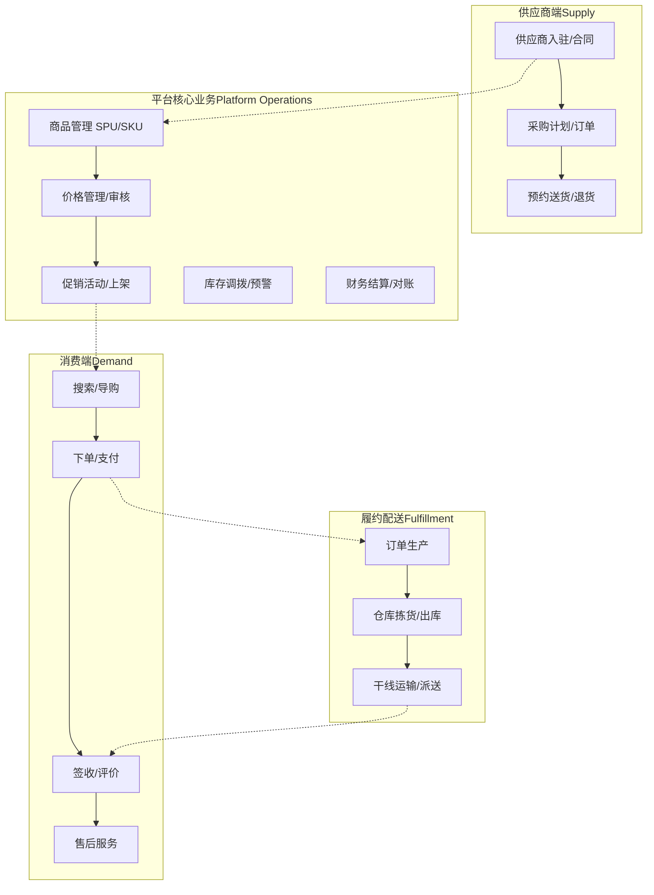
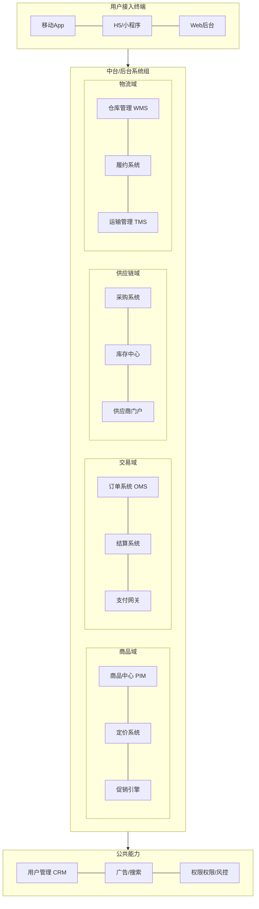

## 一、前言

在互联网行业中，B2C 电商的发展，都是从小到大，从用户几千人到用户几百万人，个别电商甚至过亿的用户数。然而这些电商业务的发展都不是一夜之间就发展起来，都有一个漫长的发展历程。

在这个漫长的业务发展过程中，电商的的系统架构演进随着业务的快速发展而变化，从原来的单体应用到多个应用，从服务化到微服务化、从分布式、中台化，系统都经过漫长的演变。

电商系统是一个具代表性的技术发展历程。这一演进过程深刻反映了业务快速增长与技术架构持续优化之间的辩证关系。本文将详细阐述一个 B2C 商城系统从 V1.0 到 V4.0 的架构演进历程，包括业务架构、应用架构等多个架构的变迁，以及每个阶段面临的核心挑战和相应的解决方案。

一个系统架构演进的驱动力通常来自多个方面：

- 用户规模的爆发式增长导致系统性能瓶颈不断显现；

- 商品品类的持续扩展对系统可维护性提出更高要求；

- 业务功能的日益复杂使得代码逻辑越来越难以管理；
- 团队规模的扩大需要更清晰的职责划分，也需要组织更高的开发效率。

理解这一演进过程，对于架构师和开发人员来说也很有意义，它不仅展示了具体技术选型的决策过程，更揭示了如何在业务快速发展压力和技术债务之间取得平衡，懂得取舍的智慧。

## 二、V1.0 时代：快速上线验证

### 2.1 业务背景和技术选型

在项目启动初期，团队面临的核心挑战是快速验证商业模式，尽快将产品推向市场接受用户检验。

这一阶段的电商业务需求非常简单：

- 功能需求相对简单，主要包含商品展示、购物车、订单处理、支付集成等核心业务流程；

- 用户规模预期有限，初期可能只有几千到几万的日活用户；

- 开发团队规模较小，通常只有 3 到 5 名开发人员；

- 项目周期紧张，需要在 1 到 2 个月内完成上线，快速上线需求。

基于上述业务背景，技术选型遵循了"简单、高效、低成本"的原则。

PHP 作为开发语言选择了开源的 ECShop 系统作为基础框架。PHP 在当时是 Web 开发的主流语言之一，其语法简洁、学习成本低、开发效率高的特点非常适合初创项目。ECShop 作为成熟的开源商城系统，提供了完整的商城基础功能，包括商品管理、会员管理、订单处理、支付接口等，团队可以在此基础上进行二次开发，快速满足业务需求。

### 2.2 V1.0 版本架构设计

#### 架构设计图

在 V1.0 版本时期的系统架构，就是典型的三层架构模式，Nginx -> WebServer -> MySQL。

所有功能模块部署在单一的服务器上，数据库使用 MySQL，处理 PHP 请求服务 PHP-FPM，缓存层几乎没有引入，文件存储使用本地磁盘。整个系统架构图如下，

V1.0 时期的系统架构图：

#### V1.0功能模块

从应用架构的角度来看，V1.0 版本的功能模块集中，所有业务逻辑都耦合在一个单体应用中。按照功能职责，可以划分为以下几个主要模块：

**前端展示层**

负责用户界面的渲染和用户交互处理，包括首页推荐、商品搜索详情页、购物车页面、用户个人中心等模块。这一层的特点是用户直接参与交互，对页面响应速度要求较高，但业务逻辑相对简单，主要是数据的展示和表单提交处理。

**业务逻辑层**

这一层是整个电商应用的核心，包含了商城的核心业务流程和各个功能模块。

- 商品模块负责商品的增删改查、库存管理、价格计算等功能；

- 会员模块处理用户注册、登录、信息修改、积分管理等事务；

- 订单模块是业务流程的枢纽，负责购物车管理、订单创建、订单支付、订单履约、售后处理等完整流程；

- 一些简单的促销功能，如折扣、优惠券等。

**数据访问层**

负责与数据库的交互，封装了所有的 SQL 操作。在 ECShop 框架中，这一层主要由模型（Model）类来实现，每个数据表对应一个模型类，提供基本的 CRUD 操作。

**第三方集成层**

负责与外部系统的对接，主要包括支付网关（支付宝、微信支付等）、物流接口（快递100、菜鸟物流等）、短信服务（阿里大鱼、腾讯短信等）。这些集成通常以插件方式形式存在，便于替换和扩展。

#### 技术栈

V1.0 版本的技术栈具有鲜明的时代特征。Web 服务器采用 Nginx 配合 PHP-FPM 的组合，这是当时 Linux 环境下最流行的 Web 服务架构。数据库使用 MySQL，考虑到初期数据量不大，采用了单实例部署方案，为了提高可靠性配置了主从复制。

缓存层几乎没有引入，唯一的缓存是 PHP 自带的 OPcode 51缓存（如APC）来提升代码执行效率。文件存储使用 Web 服务器所在的本地磁盘，商品图片等静态资源也存放在同一服务器上。操作系统选择 CentOS 或 Ubuntu 版本，Web 环境采用 LNMP（Linux + Nginx + MySQL + PHP）架构。

#### 架构扩展

随着业务发展，用户增多，功能增多。

系统架构也会进行扩展，比如 V1.1、V1.2、V1.3版本架构等。

增加 web 服务器，前面用 Nginx 做负载均衡，增加数据库扩展，一主多从，增加 Redis 缓存。

### 2.3 V1.0版本的问题

随着业务的快速发展，V1.0 架构的问题逐渐暴露出来。

**1、性能瓶颈**：

当用户量增长到一定规模，比如日活到数万时，单一服务器的架构无法承受突发的访问流量，特别是在促销活动期间，服务器 CPU 和内存使用率经常达到90%以上，响应时间从正常的几百毫秒飙升到数秒甚至超时。数据库成为最大的性能瓶颈，所有的读写操作都集中在同一个 MySQL 实例上，查询复杂度较高的报表和统计功能严重影响在线交易。

**2、可扩展性**：

V1.0 架构采用水平扩展的方式极为困难，因为所有模块都部署在同一应用中，无法针对压力较大的模块进行单独扩展。例如，当商品浏览量很大但订单量相对较小时，只能通过复制整个应用来分担压力，这造成了资源的浪费。数据库的扩展更是难题，垂直拆分需要大量的代码改造，水平拆分需要解决跨库查询和事务一致性问题。

**3、可维护性**：

随着业务功能的不断增加，代码量迅速膨胀到一个难以管理的规模。ECShop 的模板引擎虽然方便，但前端代码和业务逻辑混在一起，修改时很容易引入新的 bug。业务代码和框架代码界限不清，框架升级时需要大量兼容处理。团队成员对整个系统的理解成本越来越高，一个小需求的改动可能影响到多个看似不相关的功能。

**4、技术债务**：

为了快速上线，很多功能采用了临时方案，比如直接在数据库表中添加冗余字段、使用存储过程处理复杂业务逻辑、没有统一的异常处理机制等。这些技术债务在短期内提高了开发速度，但随着时间推移，维护成本呈指数级增长。

这些问题促使团队开始思考架构的升级改造，V2.0 版本的架构重构便提上了日程。

## 三、V2.0时代：Java重写与架构重构

### 3.1 重构驱动力与技术选型

进入 V2.0 阶段时，业务已经取得了初步成功，用户规模和交易量都有了显著增长。此时团队面临的核心挑战是：

**如何在保持业务连续性的同时，系统性地解决上一版本架构存在的性能和可维护性问题**。

经过深入的技术调研和讨论，团队决定采用 Java 语言对整个系统进行重写，这一决策基于多方面的考量。

Java 语言在企业级应用开发领域拥有成熟的生态系统。Spring 和 Spring Boot 框架提供了完善的依赖注入和面向切面编程能力，能够有效解决代码耦合问题。MyBatis、MyBatis-Plus 和 JPA 等 ORM 框架简化了数据库操作，提高了开发效率。Java 语言的强类型特性，有助于在编译期发现潜在错误，提高代码质量。丰富的开源类库和成熟的技术文档使得团队能够快速解决开发中遇到的各种问题。

此外，Java 语言在大型互联网电商企业中的广泛使用，意味着团队更容易招聘到有经验的后端开发人员，公司的技术积累也能够得到更好的传承。Java 应用的性能表现稳定可靠，在高并发场景下有成熟的优化实践。Spring Boot 框架更是大大简化了 Java 应用的配置和部署，使得开发效率得到了显著提升。

### 3.2 V2.0整体架构设计

V2.0 版本的架构，垂直拆分应用架构，主要是把应用系统进行了拆分，应用系统从单体应用拆分为多个独立的单体应用，但尚未达到微服务的程度，每个后端应用系统程序仍然采用三层结构设计，模块化功能，前后端分离，这种架构既保留了单体应用开发简便的特点，又为后续的服务化拆分奠定了一定的基础。

这时把单体应用架构拆分为前后端分离的商城前端应用、商城后端应用、管理后台应用。V1.0 时期的单一库也分为多个库 - 商品库、订单库、用户库等。

V2.0 版本的应用架构也进行了明显的职责拆分，形成了多个独立的应用系统。

**商城前端应用**：

负责用户端的页面渲染和交互处理，采用了前后端分离的思路，前端使用 Vue.js 框架构建单页应用，通过 RESTful API 与后端通信。这种分离使得前端可以独立部署和更新，提高了开发效率和用户体验。

**商城后端应用**：

提供所有的业务接口，采用 Spring Boot 框架开发，所有的业务逻辑都在这里处理。

**管理后台应用**：

供运营人员进行商品管理、订单处理、用户管理、数据统计等工作，同样采用前后端分离架构。

### 3.3 模块化设计

V2.0 版本的功能模块划分更加清晰，应用系统按照业务领域进行了垂直模块的拆分，划分如下：

**用户模块**

负责用户注册、登录、个人信息管理、会员等级、积分管理、收货地址管理等与用户相关的功能。

**商品模块**

处理商品的基础信息管理、分类管理、属性管理、SKU 管理、库存管理、价格管理等核心业务。

**交易模块**

业务核心，包含购物车、订单创建、订单支付、订单履约、售后服务等完整流程。

**营销模块**

支持各种促销活动，如优惠券、满减活动、限时折扣、拼团、秒杀等。

**内容模块**

负责文章管理、帮助中心、公告管理、评论管理等辅助功能。

**统计模块**

提供销售数据、用户行为、流量分析等数据报表

### 3.4 数据架构

在应用数据架构方面，V2.0 版本进行了架构调整。针对不同业务模块的数据特点，采用了垂直分库的策略，将原来的单一数据库拆分为商品库、订单库、用户库等多个独立的数据库。

这种拆分有几个好处：

- 不同业务的数据隔离性好，单一数据库故障不影响其他业务；

- 可以根据各业务的特点，选择不同的数据库配置和优化策略；

- 数据库连接资源可以更合理地分配。

另外，缓存层引入了 Redis 集群，主要用于 session 存储、热点数据缓存、分布式锁等场景，显著降低了数据库的读写压力。

### 3.5 技术选型与实现

V2.0 版本后端程序开发采用了 Spring Boot 2.x 作为主要框架，结合 Spring Cloud 的部分组件实现了服务治理的基础功能。

数据持久层使用 MyBatis-Plus，简化了数据库操作的开发工作。

数据库采用 MySQL 的更高版本，利用其更好的性能和更丰富的数据类型支持。缓存层引入Redis 集群，使用 Redis 实现分布式 session、热点数据缓存、消息队列等功能。

前端采用 Vue.js 2.x 框架，配合 Element UI 组件库快速构建管理后台，商城前端使用 Vue.js 构建单页应用。

另外，在基础设施方面，系统部署在阿里云 ECS 上，使用多可用区部署提高可用性。负载均衡采用阿里云 SLB 产品，支持自动健康检查和流量分发。

消息队列引入 RabbitMQ，用于处理异步任务和系统解耦。

日志收集采用 ELK（Elasticsearch + Logstash + Kibana）技术栈，便于问题排查和性能分析。

监控系统使用 Prometheus 和 Grafana，实时监控系统各项指标。

### 3.6 V2.0 存在的问题

V2.0 版本在架构上有了很大的进步，但是随着业务的快速发展，用户量快速增加，业务规模进一步扩大，新的问题逐渐显现。

**应用复杂度**

首先是应用复杂度问题，虽然进行了前后端分离和多应用系统的垂直拆分，但每个应用系统内部的业务随着业务功能的增多，业务逻辑进一步变得更加复杂，一个应用可能包含十多个业务模块甚至更多模块，代码量进一步膨胀。团队成员需要理解整个应用才能进行开发，开发效率受到明显影响，导致发布产品效率也受到了影响。

**应用模块耦合**

其次是应用模块耦合问题，所有的应用模块都需要同时部署和升级，一个业务模块的改动可能导致整个系统需要重新部署，这在实际运营中带来了很大的风险。特别是对于 7x24 小时运行的互联网服务，部署操作需要精心规划窗口期。

**扩展性问题**

最后是扩展局限性问题，虽然数据库进行了垂直拆分，但应用层面的扩展仍然不够灵活。当某个业务模块（如秒杀活动）需要临时扩展资源时，只能扩展整个应用，无法精确到扩展某个具体的模块。这样一来资源利用率不够高，成本控制面临压力。

这些问题促使团队开始思考和探索更加合理的架构，来解决这些问题，V3.0 版本服务化改造便应运而生。

## 四、V3.0时代：服务化改造与微服务架构

### 4.1 服务化的背景与目标

进入 V3.0 版本阶段时，业务已经发展到一个相当大的规模。每日的交易订单量达到十多万级别甚至更多，商品 SKU 数量超过百万，注册用户数量超过千万。在这样的用户规模下，V2.0 架构已经无法满足业务发展的需求，团队面临着一系列的烦恼——业务增长迅速，但技术架构限制了业务进一步发展的空间。

服务化改造的核心目标是实现业务能力的原子化封装和灵活组合，通过将大的应用拆分为多个小的服务，每个服务负责特定的业务领域，这些业务能够独立开发、测试、部署和扩展。

这种架构模式带来了多方面的优势：

- 服务由小团队负责，团队规模控制在 5 到 8 人，能够对服务进行全生命周期管理；

- 每个服务可以独立部署和升级，部署风险进一步降低；

- 可以根据各服务的负载情况独立扩展，资源利用效率显著提高；

- 服务之间通过标准接口通信，技术选型可以更加灵活。

### 4.2 服务化改进原则

系统服务化的改造不是一蹴而就的，而是要稳步推进。

改造过程遵循了"稳步推进、风险可控"的原则。先从边缘应用服务开始试点，积累经验后再向核心服务扩展。这种渐进式的改造方式最大限度地降低了业务中断的风险。

### 4.3 V3.0架构设计

## 业务架构图

## 应用架构图

