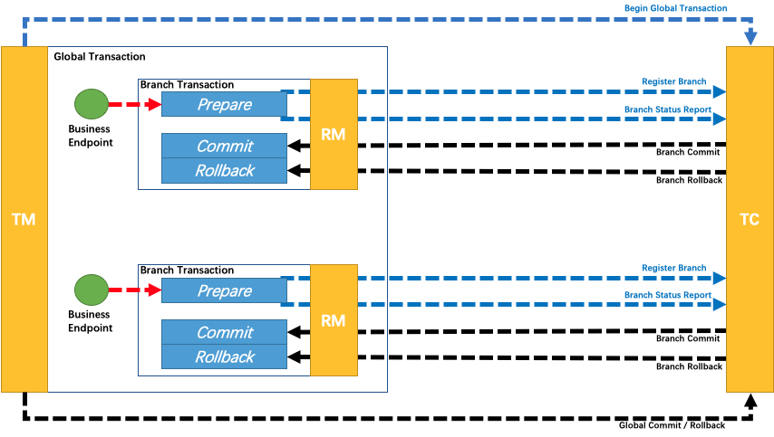

## 一、问题分析与思考过程

### 问题分析

如果是在单体应用架构中，库存、订单、支付的处理利用数据库本地事务（ACID）就可以保证一致性。用户下单时，在同一进程的事务内创建订单并扣减库存（预扣或直接扣），支付成功后更新订单状态，采用数据库行锁防止超卖，这里用数据库就可以解决数据一致性问题。

但在微服务架构下，库存、订单、支付三个服务各自独立部署，拥有独立的数据库，它们之间通过网络通信进行协作。当用户下单时，需要保证：

- **库存服务**：扣减商品库存
- **订单服务**：创建订单记录
- **支付服务**：完成支付扣款

这三个操作要么全部成功，要么全部失败，不能出现部分成功部分失败的情况。

例如，不能出现库存已扣减但订单未创建，或者订单已创建但支付失败却未退款的情况。

还有比如订单服务调用库存服务时，网络超时了，库存服务实际上可能已经扣减成功，但订单服务收到了超时异常。结果可能订单服务认为失败，尝试回滚订单；但实际上库存已被扣减。如果盲目回滚或重试，可能导致库存多扣或订单与库存状态永久不一致。

这就涉及到分布式系统的一致性问题。

### 分布式环境下的问题

在单体架构下，数据库的 ACID（原子性、一致性、隔离性、持久性）就可以保证一致性。但在分布式环境下，一致性就可能面临很多问题，

首先网络通信的不确定性，网络延迟、丢包、服务宕机等情况随时可能发生，导致部分操作成功而其他操作失败。

其次是各服务独立的事务管理，每个服务只能控制自己的数据库事务，无法直接保证其他服务的事务成功。

还有系统可用性与一致性的权衡，根据 CAP 理论，在网络分区的情况下必须在可用性和一致性之间做出选择。

### 解决方案

解决这个问题的方案主要有两种方向。

一种是**强一致性方案**，通过分布式事务协议（如 Seata 的 AT模式，还有Go语言开发的dtm）来保证各服务要么全部成功，要么全部回滚。

另一种是**最终一致性方案**，通过消息队列和补偿机制，允许短暂的不一致状态，但通过后续的补偿或重试来达到最终一致。

## 二、技术解决方案

### 方案一：强一致性 分布式事务

#### Seata XA 模式

- XA 模式文档：https://seata.apache.org/zh-cn/docs/dev/mode/xa-mode

XA 模式是标准的分布式事务协议，采用两阶段提交（2PC）：

**第一阶段（Prepare）**：

- Seata Server 向所有分支事务发送 prepare 请求
- 各服务执行事务操作，但不提交
- 各服务持有数据库锁，返回 prepare 成功或失败

**第二阶段（Commit/Rollback）**：

- 如果所有服务都返回成功，发送 commit 请求，各服务提交事务
- 如果有任何服务失败，发送 rollback 请求，各服务回滚事务

**XA 模式的特点**：

- 优点：强一致性保证，符合 ACID 特性
- 缺点：性能开销大，需要长时间持有数据库锁，可能导致系统吞吐量下降

### 方案二：最终一致性

#### Seata AT 模式

- seata AT 模式文档地址：https://seata.apache.org/zh-cn/docs/dev/mode/at-mode，文档里有一个图解说明。

- seata AT 模式代码例子：https://github.com/apache/incubator-seata-samples/tree/master/at-sample 

整体机制，基于 **两阶段提交（2PC）** 的演变版，但做了大量优化以实现非阻塞：

- 一阶段：业务数据和回滚日志记录在同一个本地事务中提交，释放本地锁和连接资源。
- 二阶段：
  - 提交异步化，非常快速地完成。
  - 回滚通过一阶段的回滚日志进行反向补偿。

第一阶段：执行各分支事务。各服务在本地数据库执行业务 SQL，同时记录 undo log（反向 SQL 用于回滚），然后向 Seata Server 注册分支事务，报告执行状态。

第二阶段：提交或回滚。Seata Server 收集所有分支事务的执行结果，

如果全部成功，则向各服务发送提交指令，各服务删除 undo log；

如果有任何失败，则发送回滚指令，各服务读取 undo log 执行反向操作。

⚠️**注意，使用AT模式前提**：

- 基于支持本地 ACID 事务的关系型数据库。
- Java 应用，通过 JDBC 访问数据库。

**适用场景**

无侵入（只需加注解）、高性能（一阶段不持锁）、支持大多数常规 SQL。

- 适合互联网业务中绝大多数需要强一致性的场景，如下单扣库存**、**支付改状态。
- **限制**：不支持隔离级别为 Read Uncommitted；对 SQL 有一定限制（如不支持多行复杂子查询等，但日常 CRUD 没问题）。

#### Seata TCC

- seata TCC 模式文档地址: https://seata.apache.org/zh-cn/docs/dev/mode/tcc-mode
- seata TCC 模式代码例子：https://github.com/apache/incubator-seata-samples/tree/master/tcc-sample

(图来自 seata.apache.org)

TCC 模式，不依赖于底层数据资源的事务支持：

- 一阶段 prepare 行为：调用 **自定义** 的 prepare 逻辑。
- 二阶段 commit 行为：调用 **自定义** 的 commit 逻辑。
- 二阶段 rollback 行为：调用 **自定义** 的 rollback 逻辑。

它的优缺点：

- **优点**：无锁时间极短（只在 Try 阶段短暂锁定），性能优于 2PC，支持人工干预。
- **缺点**：代码侵入性极大，每个服务都要写三个方法

适用于对一致性要求较高，且业务逻辑允许预留资源的场景，比如场景为资金交易、核心库存扣减等，且团队开发能力较强

#### Seata Saga(长流程事务)

Saga 模式是 SEATA 提供的长事务解决方案，在 Saga 模式中，业务流程中每个参与者都提交本地事务，当出现某一个参与者失败则补偿前面已经成功的参与者，一阶段正向服务和二阶段补偿服务都由业务开发实现。

- https://seata.apache.org/zh-cn/docs/dev/mode/saga-mode  seata saga文档

适用于业务流程长、涉及多个微服务的场景。

- **缺点**：缺乏隔离性（中间状态可见），补偿逻辑复杂，调试困难。

#### 本地消息表 + 定时任务

将同步调用改为**异步解耦**，利用消息队列（MQ）的事务消息或本地消息表机制，确保“订单创建”和“发送扣减库存消息”这两个动作要么都成功，要么都失败。

这是一种比较常用的方案，还有下面的RocketMQ事务消息方案。

本地消息表 + 定时任务 一般的步骤如下：

- **步骤 1**：订单服务在同一个本地数据库中，开启事务：(a) 创建订单记录；(b) 插入一条“待发送”的消息记录到`local_message_table`。
- **步骤 2**：事务提交。此时订单已落库，消息已记录。
- **步骤 3**：后台定时任务扫描`local_message_table`中“待发送”的消息，投递到 MQ（如 RocketMQ/Kafka）。
- **步骤 4**：库存服务消费 MQ 消息，执行扣减库存。
- **步骤 5**：库存服务处理成功后，回调订单服务更新消息状态为“已完成”；若失败则重试。

#### **RocketMQ 事务消息**

Apache RocketMQ 事务消息的方案，具备高性能、可扩展、业务开发简单的优势。具体事务消息的原理和流程，请参见如下文档：

- https://rocketmq.apache.org/zh/docs/featureBehavior/04transactionmessage/  rocketmq 事务消息文档

当然，RocketMQ 也有使用限制：

> https://rocketmq.apache.org/zh/docs/featureBehavior/04transactionmessage/#%E4%BD%BF%E7%94%A8%E9%99%90%E5%88%B6  RocketMQ 消息事务使用限制的文档

**消息类型一致性**

事务消息仅支持在 MessageType 为 Transaction 的主题内使用，即事务消息只能发送至类型为事务消息的主题中，发送的消息的类型必须和主题的类型一致。

**消费事务性**

Apache RocketMQ 事务消息保证本地主分支事务和下游消息发送事务的一致性，但不保证消息消费结果和上游事务的一致性。因此需要下游业务分支自行保证消息正确处理，建议消费端做好[消费重试](https://rocketmq.apache.org/zh/docs/featureBehavior/10consumerretrypolicy)，如果有短暂失败可以利用重试机制保证最终处理成功。

**中间状态可见性**

Apache RocketMQ 事务消息为最终一致性，即在消息提交到下游消费端处理完成之前，下游分支和上游事务之间的状态会不一致。因此，事务消息仅适合接受异步执行的事务场景。

**事务超时机制**

Apache RocketMQ 事务消息的生命周期存在超时机制，即半事务消息被生产者发送服务端后，如果在指定时间内服务端无法确认提交或者回滚状态，则消息默认会被回滚。事务超时时间，请参见[参数限制](https://rocketmq.apache.org/zh/docs/introduction/03limits)。

#### **最大努力通知（简单场景**）

适用于对一致性要求不高，允许少量丢单或通过人工对账修复的场景。

订单服务调用库存服务，失败则按指数退避策略（1s, 5s, 30s, 1m...）不断重试通知，直到达到最大次数。如果仍失败，记录日志，由人工或离线对账系统后续处理。

**优点**是实现最简单。**缺点**是不能保证 100% 最终一致性，依赖事后对账。

## 三、分布式事务方案对比

| 方案              | 一致性                                  | 性能                            | 复杂度                                  | 侵入性                  | 适用场景                                    |
| ----------------- | --------------------------------------- | ------------------------------- | --------------------------------------- | ----------------------- | ------------------------------------------- |
| 本地消息表/MQ事务 | 最终一致                                | 高 (无全局锁)                   | 中 (需设计幂等/补偿)                    | 低 (业务代码需配合)     | 电商下单、支付（高并发首选）                |
| Seata AT 模式     | 最终一致 (默认RC隔离，通过Undo Log回滚) | 高 (一阶段提交即释放本地锁)     | 低 (几乎零侵入，只需注解)               | 极低 (无需修改业务逻辑) | 互联网通用业务 (下单、库存扣减、状态流转)   |
| Seata XA 模式     | 强一致 (原生2PC，全程持锁)              | 低 (一阶段全程阻塞，持数据库锁) | 低 (配置即可)                           | 低 (需DB支持XA)         | 低频核心账务 (财务对账、银行内部转账)       |
| TCC               | 最终一致 (接近强，业务控制)             | 中 (需手动管理资源)             | 极高 (需实现 Try/Confirm/Cancel 三接口) | 极高 (业务代码大幅重构) | 核心资产变动 (支付渠道对接、资金冻结/解冻)  |
| Saga              | 最终一致                                | 中 (长流程编排)                 | 高 (需定义正向/逆向操作链)              | 中 (需编排流程)         | 跨多服务的长流程业务 (旅行预订、复杂审批流) |
| 最大努力通知      | 弱一致                                  | 高                              | 低                                      | 低                      | 非核心业务 (积分赠送、短信通知、日志同步)   |

## 四、电商下单推荐哪种

电商下单推荐 AT 或 MQ，而不是 XA/TCC，核心差异解读：

1. **Seata AT vs. XA (性能关键)**
   - **XA**：在“一阶段”就锁住数据库行记录，直到所有服务都执行完才释放。如果库存服务耗时 200ms，订单服务耗时 200ms，那么这条数据的锁会被持有至少 400ms。高并发下会导致数据库连接池瞬间耗尽，系统宕机。
   - **AT**：在“一阶段”执行完 SQL 后，立即提交本地事务并释放数据库锁（只保留 Seata 的全局锁）。其他无关的查询或非冲突更新不受影响。性能接近本地事务，适合高并发。
2. **Seata AT vs. MQ (架构权衡)**
   - **MQ (本地消息表)**：性能最高，完全异步解耦。但需要开发者自己处理消息幂等**、**消息丢失**、**补偿机制，开发和维护成本高。
   - **Seata AT**：性能略低于 MQ（因为有全局锁竞争和 Undo Log 开销），但开发体验极佳，像写本地代码一样写分布式事务，框架自动处理回滚。
   - 结论
     - 90% 的场景（普通下单、后台管理）：直接用 Seata AT，效率最高。
     - 10% 的场景**（双11秒杀、极致性能要求）：用 MQ + Redis 方案，牺牲开发复杂度换取极致性能。
3. **Seata AT vs. TCC (侵入性)**
   - **TCC**：需要为每个接口写三个方法（Try 预留资源，Confirm 确认，Cancel 撤销）。业务逻辑被割裂，代码量大，维护困难。
   - **AT**：基于 SQL 解析自动生成回滚日志，业务代码无感知。除非遇到 AT 不支持的特殊 SQL 或多数据源复杂场景，否则不建议上 TCC。

## 五、参考

- https://www.cnblogs.com/jiujuan/p/17542160.html 全面了解事务、分布式事务理论及其实现方案 - 九卷沉思录
- https://seata.apache.org/zh-cn/  分布式事务解决方案 seata
- https://seata.apache.org/zh-cn/docs/dev/mode/xa-mode  Seata XA 模式
- https://seata.apache.org/zh-cn/docs/dev/mode/at-mode  Seata AT 模式
- https://seata.apache.org/zh-cn/blog/seata-at-tcc-saga/ 分布式事务 Seata 及其三种模式详解
- https://github.com/apache/incubator-seata-samples/tree/master/at-sample  Seata AT 代码例子
- https://dtm.pub/practice/theory.html Go语言开发的开业分布式事务管理DTM
- https://rocketmq.apache.org/zh/docs/featureBehavior/04transactionmessage/  rocketmq 事务消息