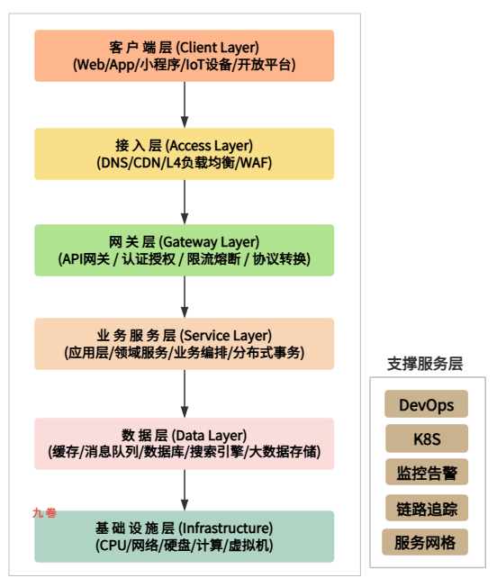
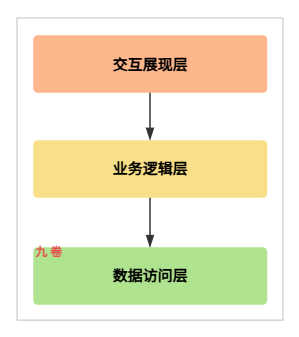
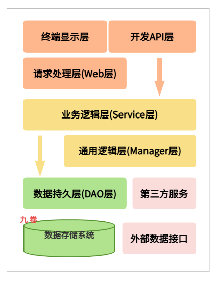
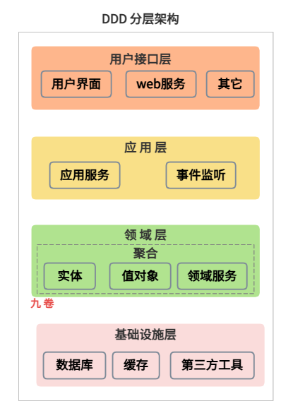
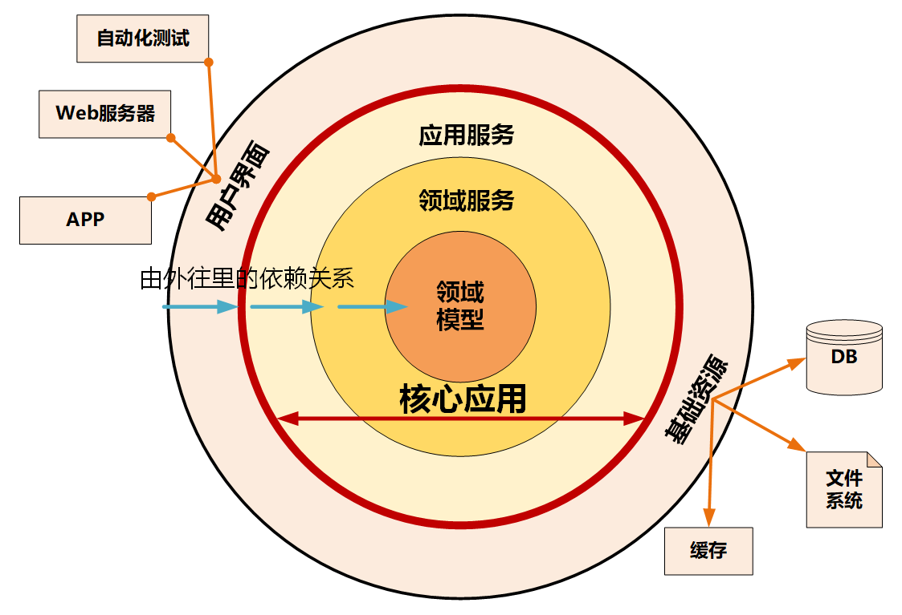

## 前言

在互联网软件开发中，高并发架构代表着用户多，大流量。比如淘宝、天猫购物网站、京东购物网站、抖音短视频等产品。

还有天猫双十一活动，京东168抢购活动，这2个购物活动都是瞬时高并发系统。它们都是业务复杂度高、链路长、数据量大的系统。

这些系统都是在一个很短的时间内会遇到大量请求情况，系统怎么处理这些请求？怎么设计系统？

设计一个高并发架构系统，需要遵循什么原则？需要用到哪些技术？下面做一个解答。

## 高并发架构一般指导原则

设计高并发系统一般指导原则。

### 分而治之

把一个大的应用系统拆分为多个较小的应用系统，把大数据量的库和表拆分为多个库、多个表。这些都是分而治之的思想。

- **垂直拆分**

**应用系统垂直拆分**：可以按照业务功能进行系统拆分，拆分为多个独立的应用。把一个大的应用系统拆分为多个系统，比如大电商系统，可以拆分为商家系统，前台商品和购物系统，后台系统管理系统。

如果再把上面拆分后的应用系统按照微服务进行拆分，进一步拆分为用户、订单、商品等相互独立的微服务，不同团队负责不同服务系统。

**数据库垂直拆分**：将一个包含所有表的单库，拆分为多个库（如订单库、用户库）。订单表归属订单库，用户表归属用户库。

- **水平拆分**

水平拆分一般是按照数据规则进行拆分，解决单库/单表数据量巨大，读写性能瓶颈的问题。

水平分库分表，将海量数据（如亿级订单数据）按照主键ID范围、用户ID取模等规则，分散到多个结构相同的数据库/表中（如 order_0, order_1...）。

### 无状态化

应用服务器不保存会话状态，以便随时水平扩展（Scale Out）。

可以把状态信息（如 session 信息）保存到外置的分布式缓存中（如 redis）。

### 异步化

利用消息队列来削峰填谷，解耦非核心链路业务。如发短信、积分、日志等。

### 冗余备份和副本

保证高可用。

数据冗余 - 主从复制、多副本。

服务冗余 - 多实例部署。

多机房部署、双活/多活部署、异地部署。

### 最终一致性

在高并发场景下，放弃强一致性，追求高可用和最终一致性。

### 缓存

空间换时间。

浏览器缓存，构建本地缓存 （应用内缓存+本机内存缓存+redis）+ 分布式缓存 + CDN的多级缓存体系。

反向代理缓存 Nginx、Varnish。

## 硬件层

高并发系统的是在有限的资源（CPU、内存、磁盘、网络）下，榨取出极致的吞吐量和极低的延迟。

在硬件层面，CPU的多核架构（如SMP、NUMA）、多级缓存（L1/L2/L3）和内存带宽直接影响并行处理能力。

### 多核/多 CPU 与并行

- **CPU核数与线程数**

CPU 内部封装一个或多个物理核，只有 1 个物理核心就是单核 CPU，有多个物理核心就是多核 CPU。

物理 core 核数，硬件线程，还有个超线程技术。高并发依赖多核并行处理。线程数并非越多越好。当线程数超过 CPU 核数时，会发生频繁的上下文切换 (Context Switch)，消耗 CPU 时间片。

> 超线程技术（全名为Hyper-Threading）：

> 这种使 CPU 处理器中的 1 颗物理核，如同 2 颗物理核那样发挥作用，从而提高了系统的整体性能。但肯定不会真的像 2 颗物理核那样，而是借助于某些技术将 1 颗物理核的性能发挥更好而已。

最佳实践：

> CPU 密集型任务，线程数 = CPU 核数 + 1；I/O 密集型任务，可适当增加线程数，但需配合异步 I/O。

指令级并行：

> CPU 通过流水线、分支预测、乱序执行来提高效率。这种乱序执行会导致指令重排，破坏多线程下的内存可见性，需要时会使用使用内存屏障阻止 CPU 的重排序。

CPU 缓存：

> CPU 读取数据先从 L1/L2/L3 缓存读取，速度比内存快几十倍。缓存以 Cache Line (通常 64 字节) 为单位加载。
>
> 使用 缓存行填充 (Padding)，确保高频竞争变量独占 Cache Line（如 Java 的 `@Contended` 注解）。

分支预测：

> CPU 会预测代码执行路径。如果预测失败，流水线需要清空，造成性能损失。
>
> 在高并发热点代码中，减少复杂的 `if-else`，使用无分支编程或查表法。

- **SMP / NUMA / MPP 架构**

**SMP**（Symmetric Multi-Processor）对称多处理器结构， 这中结构指多个 CPU 对称平等，共享相同的物理内存、IO 等资源。因此 SMP结构属于一致存储器访问结构 UMA。早期/小规模服务器常见。

**NUMA**（Non-Uniform Memory Access）非一致存储访问结构，此架构是服务器有多个 CPU 模块，每个 CPU 模块由多个 CPU 组成，每个 CPU 模块具有独立的本地内存，IO 等资源，CPU 模块也称为 Node。因此访问延迟不同，CPU 访问本地内存比访问远端内存快；跨 NUMA node 访问内存慢，是现代多路服务器的主流架构。

高并发场景下，需进行 NUMA 绑定，让进程/线程尽量在分配内存的 CPU 核心上运行，避免跨 CPU 交互导致延迟飙升。这种也叫 CPU 亲和性 - 绑定到特定核或 NUMA node 以减少开销。

**MPP**（Massive Parallel Processing），它是另外一种扩展方式，它由多个 SMP 服务器通过一定的节点网络进行连接，完成相同的任务，可以看作是 SMP 的水平扩展。典型的就是刀片服务器，有的说 MPP 架构很像 MapReduce 模式。

### 内存

**内存带宽 (Memory Bandwidth)**：

高并发下，大量数据拷贝会打满内存带宽。这种情况需减少内存拷贝（零拷贝技术），使用对象池复用内存，避免频繁 GC 分配。

如果内存带宽是所有 CPU 共享，高并发下，内存访问竞争激烈，会导致 CPU 停顿（Stall），即“内存墙”问题。这种情况优化数据结构的紧凑性（如从 `Linked List` 改为 `Array`），利用空间局部性，提高缓存命中率，减少直接访问主内存的次数。

**NUMA架构**，在多路 CPU 服务器上，CPU 访问本地内存快，访问“远程内存”（连接在另一个 CPU 上的内存）慢。如果进程被调度到 CPU 0，但分配的内存属于 CPU 1，访问延迟会增加。开启 NUMA 亲和性，将进程绑定在特定 CPU 节点，并分配该节点的本地内存。

### 网络 网卡

**多队列网卡 (Multi-Queue NIC)**：传统单队列网卡，所有网络中断由一个 CPU 核心处理，成为瓶颈。多队列网卡可将不同连接的中断分配到不同 CPU 核心。利用 RSS (Receive Side Scaling) 技术，根据 IP/Port Hash 将流量分发到不同队列。

还可以配合操作系统的 RPS/RFS，让处理网络数据包的 CPU 核心和执行应用的 CPU 核心保持一致，提高缓存亲和性，避免数据在核心间颠簸。

**智能网卡 (SmartNIC / DPU)**：将 TCP/IP 协议栈、加密、负载均衡卸载到网卡硬件上，释放主机 CPU 资源给业务逻辑。

### 存储 硬盘

**HDD 到 SSD 到 NVMe**：HDD 寻道时间毫秒级，SSD 百微秒级，NVMe 可到十微秒级。

**持久内存 (Optane/PMEM)**：介于内存和磁盘之间，断电不丢失，速度接近内存，用于极致高性能的日志或数据库 WAL。

**NVMe SSD**：高并发系统通常伴随大量日志写入或持久化。机械硬盘 (HDD) 的随机 I/O 性能极差。关注 IOPS (每秒读写次数) 而非吞吐量。NVMe 通过 PCIe 通道直连 CPU，延迟极低。

**其它优化项**：顺序读写远快于随机读写、DMA 技术、零拷贝技术zero copy。

## 操作系统OS

操作系统是硬件资源的管理者，是应用与硬件之间的桥梁。高并发下，如何高效地利用 OS 提供的一些机制高效调度资源。

### 进程/线程调度

**上下文切换开销**：线程切换涉及保存/恢复寄存器、刷新 TLB、调度器算法运行。一次上下文切换耗时通常在微秒级，看似不多，但高并发下每秒成千上万次切换，CPU 就会空转在切换上，而非业务计算。

优化措施：

1、减少线程，使用协程（Goroutine/Fiber）减少 OS 线程数量，由用户态调度，切换成本极低（纳秒级）。还可以使用 Reactor 模型，单线程处理多连接。

2、将关键进程/线程绑定到特定 CPU 核（`taskset` `pthread_setaffinity_np`），避免被 OS 调度到其他核，减少缓存失效。

**调度策略**：Linux 默认调度器为追求公平的 CFS 调度器，但在高并发下，可能需要调整为 `SCHED_FIFO` 或 `SCHED_RR` 实时调度策略，确保核心线程及时获得 CPU。

### 内存管理

**页缓存 (Page Cache)**：Linux 会将磁盘文件缓存在空闲内存中。高并发读多写少场景，利用 Page Cache 可极大提升速度。

**大页内存 (Huge Pages)**：默认页大小 4KB，大页为 2MB/1GB。减少 TLB Miss（页表缺失），提升内存访问速度。

**Swap 交换分区**：高并发系统关闭 Swap。一旦内存不足使用磁盘 Swap（`vm.swappiness=0`），系统性能会下降几个数量级（雪崩）。

**内存分配器**：多线程频繁分配释放内存时，全局锁（如 ptmalloc）会成为瓶颈。使用更高效的内存分配器，如 jemalloc 或 tcmalloc（Google 出品），它们通过线程局部缓存，大幅减少锁竞争。

### I/O 模型

**I/O 多路复用 (Multiplexing)**：select/poll/epoll，epoll 优势，事件回调机制，只通知就绪的 FD，无需遍历所有连接；红黑树 + 就绪链表，高效管理连接状态。

**信号驱动 I/O** 和 **异步 I/O (AIO)**。

**io_uring**：linux AIO 异步IO，基于共享环 (Ring Buffer)，用户态和内核态无需系统调用 (Syscall) 即可提交/获取 I/O 请求，极大减少上下文切换。

### 网络协议栈

Linux 内核的 TCP 参数直接决定网络并发能力，TCP 参数的一些调整：

- 连接复用
  - `tcp_tw_reuse = 1`：允许重用 TIME_WAIT 状态的 socket，解决高并发短连接导致端口耗尽问题。
  - `tcp_keepalive_time`：调整心跳检测，快速清理死连接。

- 队列长度
  - `tcp_max_syn_backlog`：半连接队列长度（SYN Received 状态）。
  - `somaxconn`：全连接队列长度（Established 状态，等待 accept）。

其它 增大 `tcp_rmem / wmem`：扩大读写缓冲区，提升大文件传输效率。

### 中断处理

网卡收到数据包，触发硬中断（HardIRQ），硬中断处理程序要极快完成，然后触发软中断（SoftIRQ）交给内核线程处理协议栈。

如果网络流量巨大，`ksoftirqd` 这个内核线程会占满整个 CPU，导致业务进程无法运行。

优化措施：

查看 `/proc/softirqs` 和 `/proc/interrupts`，监控中断分布。必要时调整中断亲和性（SMP IRQ Affinity），将网卡中断分散到多核，或者使用 Busy Polling 模式，让应用进程主动轮询网卡，减少中断上下文切换。

DPDK 技术：

在用户态直接接管网卡驱动，绕过内核协议栈。完全由用户态轮询网卡，屏蔽内核中断。消除系统调用、中断、内存拷贝开销。转发性能。

DPDK 技术代价是：开发复杂度极高，独占网卡，失去通用网络功能。

## 架构层：分层架构设计

分层架构（Layered Architecture）是互联网系统架构设计中最重要的方法论之一。它将复杂的系统划分为若干个逻辑或物理层次，每一层负责特定的职责，层与层之间通过定义良好的接口协议、消息队列等进行通信。

在[微服务架构学习与思考(03)：微服务总体架构图解](https://www.cnblogs.com/jiujuan/p/13295147.html) 一文中的微服务总体架构图就是一个分层架构图。多数互联网系统架构都可以用这个分层架构或它的变体。

### 分层架构图

技术架构分层架构图，6 层架构设计图：

下面对各层技术进行简单说明。

### 第一层：客户端层

客户端层是请求的发起端，客户端一般有Web、APP（安卓、IOS）、桌面端、小程序、loT设备、其它终端设备等。

这一层的优化原则：

- 减少请求数、减少数据包大小、优化网络、端侧缓存。

一些优化实践：

1. **资源压缩**：图片 WebP/AVIF 格式，代码压缩 Minify/Gzip。 
2. **合并请求**：HTTP/2 多路复用，GraphQL 减少过度获取。
3. **本地缓存**：利用 LocalStorage/IndexedDB 缓存静态资源
4. **预加载**：根据用户行为预测，提前加载资源

用到的一些网络传输协议：

- HTTP/2, HTTP/3 (QUIC), WebSocket

### 第二层：接入层

接入层是应用系统的入口，负责流量调度、安全等任务。

- DNS：可以实现全球流量调度，实现地理位置级别的负载均衡。

  - 智能 DNS
  - HTTPDNS

- CDN：CDN内容分发网络。将静态资源（图片、视频、CSS文件）缓存到离用户最近的节点，极大提升访问速度，降低源站压力。

- 负载均衡

  - L4 负载均衡：传输层，四层负载均衡，如 LVS/DPVS/MetalLB，内核级转发，百万级并发，支持DR/NAT/TUN模式
  - L7 负载均衡：应用层，七层负载均衡，如 Nginx、OpenResty

  上面是软件负载均衡，还有硬件负载均衡，

  - 硬件负载均衡：F5、A10等

- WAF：Web应用防火墙，SQL注入/XSS/CSRF防护

- DDoS防护：高防IP/边缘WAF，流量清洗，黑洞策略，边缘拦截，分层防御-边缘节点拦截恶意流量，保护源站

### 第三层：网关层

网关层作为统一入口层，用于安全防护、流量治理、协议适配、请求路由、认证授权、限流熔断、日志监控等功能。

**API 网关**：

- Nginx： 反向代理、限流。还有在 Nginx 上加强版如下
  - OpenResty
  - kong  、 APISIX
- Spring Cloud Gateway：Java生态深度集成。
- Envoy：适合 Service Mesh 服务网格

**Kubernetes 技术环境**：

- Ingress Controller（如Nginx Ingress、Traefik）成为标准的流量入口解决方案

API 网关选型：

> 在选择 API 网关时，需要考虑性能表现、功能扩展性、运维复杂度、社区活跃度等因素。对于大规模互联网系统，建议自研或基于开源方案深度定制，以满足特定的业务需求。
>
> API 网关的设计应当遵循无状态原则，便于水平扩展，同时需要做好降级方案，确保网关故障时不影响核心业务。

**认证授权技术**：

- OAuth 2.0 / JWT / OPA。JWT无状态适合微服务，OPA细粒度策略引擎

**熔断限流**：

- Sentinel / Hystrix / Resilience4j

**协议转换技术**：

- gRPC-Web/GraphQL，HTTP/1 ↔ HTTP/2，REST ↔ gRPC

**设计实践**：

- **无状态设计**：网关不保存会话，支持水平扩展
- **插件化架构**：认证、限流、日志等功能插件化，按需加载
- **冷热分离**：核心路由规则内存缓存，配置热更新
- **灰度发布**：基于用户 ID 尾号、地域、设备类型、IP、Header等渐进式放量
- **流量染色**：自定义网关插件。基于 Header 实现灰度、压测标记、链路隔离等

### 第四层：业务服务层

这一层属于软件应用系统、业务处理系统。

领域建模、业务逻辑处理、业务规则处理、服务编排。实现具体的业务流程。

#### 软件程序设计原则

- 高内聚 低耦合：高内聚就是 软件系统中职责相关性和集中度高的功能放一起。低耦合就是编写软件时类、模块、组件等之间尽量独立，互不干扰。
- KISS原则：kiss 原则(Keep It Simple, Stupid)就是简单优于复杂。
- 面向对象的SOLID原则
  - 单一职责原则：又称单一功能原则，一个类或模块只负责一项功能和业务逻辑。
  - 依赖倒置原则：上层模块不应该依赖下层模块，两者应该依赖抽象；抽象不应该依赖细节，细节应该依赖抽象。一句话，面向接口编程。
  - 接口隔离原则：一个类对另一个类的依赖应该建立在最小的接口上
  - 控制反转/依赖注入：也是 “高内聚低耦合” 中低耦合的一种实现
- 关注点分离：这个与 “高内聚低耦合” 差不多

#### 应用软件架构分层

为了实现高内聚低耦合的架构实现，通常会对业务软件程序进行分层架构。常见的分层架构进行解耦：

**MVC** 

- model 模型层，用于封装应用业务逻辑相关数据和对数据处理方法。

- view 表现层，把数据展示给用户。

- controller，控制器层，把不同层代码组织起来，用来控制程序的流程。接收 HTTP请求，解析参数。

比如 spring 框架里的 springmvc 就是用的 mvc 架构。

**三层架构**

三层架构设计

三层架构从上往下，用户界面层（User Interface Layer）、业务逻辑层（Business Logic Layer）与数据访问层（Data Access Layer）组成，依赖方向是上层对下层的调用，层与层之间可以使用接口实现。这个三层架构隔离了业务逻辑与数据访问逻辑。

**阿里巴巴java开发规范应用分层**

   这个应用架构分层是alibaba阿里巴巴java开发规范：

以下内容来自阿里巴巴java开发规范：

- 开放 API 层：可直接封装 Service 接口暴露成 RPC 接口；通过 Web 封装成 http 接口；网关控制层等
- 终端显示层：各个端的模板渲染并执行显示的层。当前主要是 velocity 渲染，JS 渲染，JSP 渲染，移动端展示等
- Web 层：主要是对访问控制进行转发，各类基本参数校验，或者不复用的业务简单处理等
- Service 层：相对具体的业务逻辑服务层。
- Manager 层：通用业务处理层，它有如下特征：
  - 对第三方平台封装的层，预处理返回结果及转化异常信息，适配上层接口。
  - 对 Service 层通用能力的下沉，如缓存方案、中间件通用处理。
  - 与 DAO 层交互，对多个 DAO 的组合复用。
- DAO 层：数据访问层，与底层 MySQL、Oracle、Hbase、OB 等进行数据交互。
- 第三方服务：包括其它部门 RPC 服务接口，基础平台，其它公司的 HTTP 接口，如淘宝开放平台、支 付宝付款服务、高德地图服务等。
- 外部数据接口：外部（应用）数据存储服务提供的接口，多见于数据迁移场景中

**DDD的4层分层架构**

DDD 领域驱动设计 4 层架构：

- 用户接口层：用户接口层（如 Controller、Web 页面）负责接收用户的 HTTP 请求，解析参数，调用应用层的“应用服务”来编排业务流程。依赖应用层。
- 应用层：负责协调业务逻辑，但它不包含核心业务规则，它需要依赖领域层中的**实体**、**值对象**和**领域服务**来完成任务。负责调用领域对象的方法，持久化对象（调用仓储接口），发布领域事件，权限校验，事务控制等。依赖领域层。
- 领域层：业务实体、业务规则，仓储接口 - 仅定义操作数据库接口，实现在基础设施层。它不依赖任何层，它被应用层、基础设施层依赖。
- 基础设施层：数据库操作、外部服务调用、缓存、消息队列、第三方服务等实现，实现领域层的仓储接口。

> 传统不合理的做法：领域层依赖基础设施层。如果领域层的实体直接调用基础设施层的 DB 操作（比如直接写 SQL 或调用 DAO），会导致业务逻辑被数据库细节污染，领域层不再纯粹，难以进行单元测试。
>
> 正确做法：在领域层中定义接口，在基础设施层中编写实现类。基础设施层“实现”了领域层定义的接口。
>
> 这种设计保证了**领域层（核心业务逻辑）完全不依赖任何具体技术细节**（数据库、消息队列、外部API）。无论基础设施层是从 MySQL 切换到 PostgreSQL，还是改为纯内存存储，领域层的代码都不需要修改一行。

**洋葱架构**

洋葱架构图：

- 领域模型层：洋葱架构的核心部分。领域模型层包含了业务领域中的核心概念，如实体、值对象以及它们之间的关系和业务规则。
- 领域服务层：领域服务层主要包含了一些跨领域实体的业务逻辑或复杂的业务操作。这些操作不能简单地归属于某个单一的领域实体，而是需要协调多个领域实体来完成。
- 应用服务层：主要负责协调领域服务和外部接口（如用户界面、外部系统接口等）之间的交互。它接收来自外部的请求，调用相应的领域服务来处理请求，并将处理结果返回给外部请求。
- 基础资源层：主要负责提供软件系统运行所需的外部资源和服务，如数据库访问、缓存、第三方服务、网络通信等。

> 上面的架构设计分层是一些标准的分层架构，如果是简单应用开发，不需要划分这么细致，可以适当的缩减层次或合并一些分层。

#### 技术与框架

**应用开发框架**

- Spring/SpringBoot - java技术体系
- Gin、hertz - - Go技术体系

**微服务开发框架**

- SpringCloud 、Dubbo - java 技术体系
- go-zero、go-kratos、Kitex - Go技术体系

**服务注册与发现**

- Nacos / Consul / Eureka / etcd

**配置中心**

-  Nacos / Apollo

**RPC通信**

- gRPC / Dubbo / Feign

gRPC基于 HTTP/2+Protobuf，性能最优。

**分布式事务**

- Seata / TCC

**链路追踪**

- SkyWalking / Jaeger

更多详细的关于微服务技术体系看这篇文章：[微服务架构学习与思考(04)：微服务技术体系以及Go和Java语言微服务技术栈常用组件介绍](https://www.cnblogs.com/jiujuan/p/13301055.html) 

#### 一些优化实践

1. 异步解耦：非核心链路（如发通知、积分）通过 MQ 异步处理。
2. 多级缓存：本地缓存 (Guava/Caffeine) + 分布式缓存 (Redis)。
3. 批量处理：合并多个小请求为一个大请求（Batching）。
4. 超时控制：所有外部调用必须设置 Timeout。
5. 无状态设计：Session 存入 Redis，服务节点可随时扩缩容。
6. gRPC (跨语言/HTTP2)，性能好

### 第五层：数据层

数据层负责数据的持久化存储、检索、计算、获取、CRUD ，大数据存储、计算和分析等操作。

**关系型数据库**：

- MySQL
- PostgreSQL
- Oracle
- SQL Server

存储核心、结构化、需要强一致性保证的业务数据，如订单、用户信息等。

**分库分表**：

- ShardingSphere
- MyCat
- Vitess

**NoSQL**：NoSQL 是“not only SQL”（不仅是SQL）的缩写，指的是以非表格格式存储数据的非关系型数据库。

- kv键值数据库：Redis、Dynamo 可以把它理解为一个分布式的 Hashmap、Memcached、Riak
- 列式数据库：即列存储数据库，其主要优点包括高效的查询性能、快速的数据压缩和适合分析型应用。 常见的列式数据库有Apache HBase、Cassandra、Google Bigtable、Amazon Redshift、ClickHouse等
- 文档数据库：MongoDB、CouchDB等。应对海量数据、高并发、特定数据模型。特定数据模型比如文档、json格式数据等。
- 图数据库：Neo4j、HugeGraph、Dgraph等
- 时序数据库：InfluxDB、TimescaleDB、Graphite等

**NewSQL**：NewSQL既保持了传统关系型数据库在事务处理的特性（ACID特性：原子性、一致性、隔离性、持久性）和SQL查询方面的能力，又具备 NoSQL 数据库的水平扩展性和对非结构化数据的支持能力，能够在大规模数据处理和高并发场景下提供高效的性能。

- TiDB 
- CockroachDB
- Google Spanner
- OceanBase

**搜索引擎**：

- Elasticsearch
- OpenSearch
- Solr

**消息队列**：

- kafka
- RocketMQ

**大数据存储**：

- Hadoop / HDFS  / Hive / HBase

**大数据查询、计算与分析**：

- Spark
- Flink
- Storm
- Apache Doris：是一个基于 MPP 架构的易用、高性能、实时的分析型数据库，以其极速和易用性。成为报表分析、即席查询、统一数仓构建、数据湖查询加速等场景的理想工具。
- Druid：一个高性能实时分析数据库，能够在大规模且负载下对流和批处理数据进行亚秒级查询
- kylin
- StarRocks
- ClickHouse
- Apache Impala
- presto：一款分布式 SQL 大数据查询引擎

**数据仓库(Data Warehouse) 、数据湖（Data lake）、湖仓一体（Lakehouse）**

**分布式和对象存储**：

- Ceph

- MinIO
- RustFS
- apache ozone
- JuiceFS
- 各大云厂商的对象存储服务

### 第六层：基础设施层

这一层不再关注软件逻辑，而是关注计算、存储、网络等物理资源的提供与管理。它的核心目标是：为上层软件提供稳定、高效、弹性、可扩展的资源底座。

**存储介质**：

- **HDD**：大容量、低成本，但随机读写性能差，延迟在毫秒级。适合冷数据存储。
- **SSD**：性能远高于 HDD，延迟在微秒级。现代高性能数据库、缓存的首选。
- **NVMe SSD**：通过 PCIe 总线直连 CPU，拥有极致的 IOPS（每秒读写次数）和吞吐量，是高性能、低延迟场景的终极选择。
- **接口与协议**：SATA, SAS, NVMe，不同的接口和协议决定了数据传输的带宽和延迟上限。

**虚拟机技术**：

- **核心**：通过Hypervisor（如KVM, Xen, VMware ESXi）模拟出完整的硬件环境（CPU、内存、硬盘、网卡），让多个操作系统（称为“客户机”）能独立、安全地运行在同一台物理机上。
- **资源隔离**：强隔离，每个虚拟机都有自己的内核，安全性高。
- **性能开销**：存在一定的性能损耗，因为硬件访问需要经过Hypervisor的转换。

**容器技术**：

- **核心**：基于 Linux 内核的 Namespace（命名空间）和 Cgroups（控制组）技术，在操作系统层面实现资源的隔离和限制。容器共享主机的操作系统内核，但拥有自己独立的文件系统、网络空间和进程树。
- **轻量级**：因为没有独立的 Guest OS，容器启动快、占用资源少，几乎可以认为有“裸机性能”。
- **资源隔离**：隔离性较虚拟机稍弱（共享内核）。
- **应用场景**：微服务、云原生应用的理想部署单元，与编排平台（如Kubernetes）是天作之合。

**软件定义技术**：

- **软件定义计算**：即虚拟机和容器技术本身。
- **软件定义存储 (SDS)**：如 Ceph**、**Longhorn，将多台服务器的本地硬盘池化，通过软件层提供高可用、可扩展的分布式块存储、文件存储或对象存储服务。它实现了存储资源与特定硬件设备的解耦。
- **软件定义网络 (SDN)**：如 Open vSwitch**、**Flannel**、**Calico，通过软件来控制网络流量的转发路径和策略。在云环境中，它可以创建虚拟网络、VPC（虚拟私有云）、安全组等，实现多租户网络隔离和灵活的网络拓扑。

**云服务层 (Cloud Services)**：

- IaaS (基础设施即服务)
- CaaS (容器即服务) / KaaS (Kubernetes即服务)
- Serverless (无服务器计算)

## 参考

- [《大型网站技术架构：核心原理与案例分析》](https://book.douban.com/subject/25723064/ ) 李智慧

- [《亿级流量网站架构核心技术》](https://book.douban.com/subject/26999243/) 张开涛

- [微服务架构学习与思考(04)：微服务技术体系以及Go和Java语言微服务技术栈常用组件介绍](https://www.cnblogs.com/jiujuan/p/13301055.html) 九卷

- https://github.com/alibaba/p3c/tree/master 阿里巴巴java开发规范

- https://db-engines.com/en/ 

- https://db-engines.com/en/ranking/relational+dbms

- https://github.com/opensearch-project

  